# V2 Resort Database Schema - Entity Relationship Diagram

## Overview

The V2 Resort database is built on PostgreSQL via Supabase, featuring:
- **Row Level Security (RLS)** for data isolation
- **UUID primary keys** for distributed compatibility
- **Soft deletes** where appropriate
- **Audit timestamps** on all tables

---

## Entity Relationship Diagram (Mermaid)

```mermaid
erDiagram
    %% Core User Tables
    users ||--o{ chalet_bookings : makes
    users ||--o{ pool_tickets : purchases
    users ||--o{ table_reservations : creates
    users ||--o{ user_credits : has
    users ||--o{ pool_memberships : subscribes
    users ||--o{ notifications : receives
    users ||--o{ password_history : has
    
    %% Chalet Module
    chalets ||--o{ chalet_bookings : "booked for"
    chalets ||--o{ chalet_amenities : has
    chalets ||--o{ chalet_images : has
    chalet_bookings ||--o{ booking_addons : includes
    chalet_bookings ||--o{ payments : generates
    
    %% Pool Module
    pool_memberships ||--o{ membership_members : includes
    pool_memberships ||--o{ guest_pass_usage : tracks
    pool_tickets ||--o{ pool_entries : logs
    
    %% Restaurant Module
    restaurant_tables ||--o{ table_reservations : "reserved at"
    restaurant_tables ||--o{ kitchen_orders : "served at"
    kitchen_orders ||--o{ kitchen_order_items : contains
    menu_categories ||--o{ menu_items : contains
    menu_items ||--o{ kitchen_order_items : "ordered as"
    
    %% Payment & Financial
    payments ||--o{ payment_ledger : "logged in"
    users ||--o{ payments : makes
    cancellation_policies ||--o{ chalet_bookings : applies
    seasonal_pricing_rules ||--o{ price_history : generates
    
    %% Admin & System
    staff ||--o{ activity_logs : generates
    staff }|--|| users : "is a"
    system_settings ||--o{ branding_assets : contains
    security_audit_log }|--|| users : "triggered by"

    %% Entity Definitions
    users {
        uuid id PK
        string email UK
        string first_name
        string last_name
        string phone
        string role
        boolean email_verified
        timestamp last_password_change
        boolean two_factor_enabled
        string two_factor_secret
        int failed_login_attempts
        timestamp locked_until
        jsonb preferences
        timestamp created_at
        timestamp updated_at
    }

    chalets {
        uuid id PK
        string name
        text description
        int capacity
        int bedrooms
        int bathrooms
        decimal base_price
        decimal weekend_price
        string status
        boolean is_active
        jsonb location
        time check_in_time
        time check_out_time
        timestamp created_at
        timestamp updated_at
    }

    chalet_bookings {
        uuid id PK
        uuid user_id FK
        uuid chalet_id FK
        date check_in
        date check_out
        int guests
        decimal total_price
        string status
        string payment_status
        text special_requests
        jsonb guest_details
        text cancellation_reason
        timestamp cancelled_at
        decimal refund_amount
        timestamp modified_at
        timestamp created_at
        timestamp updated_at
    }

    pool_tickets {
        uuid id PK
        uuid user_id FK
        date ticket_date
        string slot
        int adults
        int children
        decimal total_price
        string status
        string qr_code
        timestamp used_at
        timestamp created_at
    }

    pool_memberships {
        uuid id PK
        uuid user_id FK
        string type
        string billing_cycle
        string status
        date start_date
        date end_date
        decimal monthly_price
        string stripe_subscription_id
        boolean auto_renew
        int guest_passes_remaining
        timestamp created_at
        timestamp updated_at
    }

    restaurant_tables {
        uuid id PK
        int table_number UK
        int capacity
        string section
        string status
        int position_x
        int position_y
        string shape
        boolean is_active
        jsonb features
        timestamp created_at
    }

    table_reservations {
        uuid id PK
        uuid user_id FK
        uuid table_id FK
        date reservation_date
        time reservation_time
        int party_size
        string status
        string guest_name
        string guest_phone
        text special_requests
        string confirmation_code UK
        timestamp created_at
    }

    kitchen_orders {
        uuid id PK
        uuid table_id FK
        string order_number UK
        string status
        uuid created_by FK
        uuid started_by FK
        uuid ready_by FK
        uuid completed_by FK
        text kitchen_notes
        timestamp ready_at
        timestamp completed_at
        timestamp cancelled_at
        text cancellation_reason
        timestamp created_at
    }

    menu_items {
        uuid id PK
        uuid category_id FK
        string name
        text description
        decimal price
        string image_url
        boolean is_available
        int prep_time_minutes
        jsonb allergens
        int sort_order
        timestamp created_at
    }

    payments {
        uuid id PK
        uuid user_id FK
        uuid booking_id FK
        string booking_type
        decimal amount
        string currency
        string status
        string stripe_payment_id
        string stripe_intent_id
        jsonb metadata
        timestamp created_at
    }

    seasonal_pricing_rules {
        uuid id PK
        string name
        string description
        date start_date
        date end_date
        decimal multiplier
        string[] apply_to_days
        boolean is_active
        int priority
        timestamp created_at
    }

    security_audit_log {
        uuid id PK
        uuid user_id FK
        string event_type
        string severity
        text description
        string ip_address
        text user_agent
        jsonb metadata
        timestamp created_at
    }

    system_settings {
        string key PK
        jsonb value
        string category
        text description
        timestamp updated_at
        uuid updated_by FK
    }
```



---

## Table Descriptions

### Core Tables

#### `users`
Primary user table for all system users including customers and staff.

| Column | Type | Constraints | Description |
|--------|------|-------------|-------------|
| id | uuid | PK, default gen_random_uuid() | Unique identifier |
| email | varchar(255) | UNIQUE, NOT NULL | User email address |
| first_name | varchar(100) | NOT NULL | First name |
| last_name | varchar(100) | NOT NULL | Last name |
| phone | varchar(20) | | Phone number |
| role | varchar(20) | DEFAULT 'customer' | customer, staff, admin, superadmin |
| email_verified | boolean | DEFAULT false | Email verification status |
| two_factor_enabled | boolean | DEFAULT false | 2FA status |
| two_factor_secret | text | | Encrypted TOTP secret |
| failed_login_attempts | int | DEFAULT 0 | Failed login counter |
| locked_until | timestamp | | Account lockout expiry |
| preferences | jsonb | DEFAULT '{}' | User preferences |
| created_at | timestamp | DEFAULT now() | Creation timestamp |
| updated_at | timestamp | DEFAULT now() | Last update timestamp |

**Indexes:**
- `idx_users_email` on `email`
- `idx_users_role` on `role`

**RLS Policies:**
- Users can read/update their own record
- Admin can read/update all users

---

#### `staff`
Extended information for staff users.

| Column | Type | Constraints | Description |
|--------|------|-------------|-------------|
| id | uuid | PK, FK users(id) | Links to users table |
| department | varchar(50) | NOT NULL | Department name |
| position | varchar(100) | | Job title |
| hire_date | date | | Employment start date |
| hourly_rate | decimal(10,2) | | Pay rate |
| is_active | boolean | DEFAULT true | Employment status |
| permissions | jsonb | DEFAULT '[]' | Specific permissions |

---

### Chalet Module

#### `chalets`
Chalet/accommodation definitions.

| Column | Type | Constraints | Description |
|--------|------|-------------|-------------|
| id | uuid | PK | Unique identifier |
| name | varchar(100) | NOT NULL | Chalet name |
| description | text | | Full description |
| capacity | int | NOT NULL | Maximum guests |
| bedrooms | int | DEFAULT 1 | Number of bedrooms |
| bathrooms | int | DEFAULT 1 | Number of bathrooms |
| base_price | decimal(10,2) | NOT NULL | Weekday price |
| weekend_price | decimal(10,2) | | Weekend price override |
| status | varchar(20) | DEFAULT 'active' | active, maintenance, inactive |
| is_active | boolean | DEFAULT true | Availability flag |
| location | jsonb | | GPS coordinates |
| check_in_time | time | DEFAULT '15:00' | Check-in time |
| check_out_time | time | DEFAULT '11:00' | Check-out time |

**Indexes:**
- `idx_chalets_status` on `status`
- `idx_chalets_capacity` on `capacity`

---

#### `chalet_bookings`
Chalet reservations and booking records.

| Column | Type | Constraints | Description |
|--------|------|-------------|-------------|
| id | uuid | PK | Unique identifier |
| user_id | uuid | FK users(id), NOT NULL | Booking user |
| chalet_id | uuid | FK chalets(id), NOT NULL | Booked chalet |
| check_in | date | NOT NULL | Check-in date |
| check_out | date | NOT NULL | Check-out date |
| guests | int | NOT NULL | Number of guests |
| total_price | decimal(10,2) | NOT NULL | Total booking price |
| status | varchar(20) | DEFAULT 'pending' | pending, confirmed, checked_in, checked_out, cancelled, no_show |
| payment_status | varchar(20) | DEFAULT 'pending' | pending, paid, refunded, partial_refund |
| special_requests | text | | Guest special requests |
| guest_details | jsonb | | Guest contact info |
| cancellation_reason | text | | Reason for cancellation |
| cancelled_at | timestamp | | Cancellation timestamp |
| refund_amount | decimal(10,2) | | Refund amount if cancelled |
| modified_at | timestamp | | Last modification time |

**Indexes:**
- `idx_bookings_user` on `user_id`
- `idx_bookings_chalet` on `chalet_id`
- `idx_bookings_dates` on `check_in, check_out`
- `idx_bookings_status` on `status`

**Constraints:**
- `check_out > check_in`
- No overlapping bookings for same chalet

---

### Pool Module

#### `pool_tickets`
Individual pool access tickets.

| Column | Type | Constraints | Description |
|--------|------|-------------|-------------|
| id | uuid | PK | Unique identifier |
| user_id | uuid | FK users(id) | Purchasing user |
| ticket_date | date | NOT NULL | Date of access |
| slot | varchar(20) | NOT NULL | morning, afternoon, full_day |
| adults | int | DEFAULT 1 | Number of adults |
| children | int | DEFAULT 0 | Number of children |
| total_price | decimal(10,2) | NOT NULL | Ticket price |
| status | varchar(20) | DEFAULT 'pending' | pending, confirmed, used, cancelled, expired |
| qr_code | text | | Secure QR code data |
| used_at | timestamp | | Entry timestamp |

**Indexes:**
- `idx_tickets_date` on `ticket_date`
- `idx_tickets_user` on `user_id`

---

#### `pool_memberships`
Pool membership subscriptions.

| Column | Type | Constraints | Description |
|--------|------|-------------|-------------|
| id | uuid | PK | Unique identifier |
| user_id | uuid | FK users(id), NOT NULL | Member user |
| type | varchar(20) | NOT NULL | individual, family, corporate, vip |
| billing_cycle | varchar(20) | NOT NULL | monthly, quarterly, annually |
| status | varchar(20) | DEFAULT 'active' | active, paused, cancelled, expired |
| start_date | date | NOT NULL | Membership start |
| end_date | date | | Membership end (if not auto-renew) |
| monthly_price | decimal(10,2) | NOT NULL | Price per month |
| stripe_subscription_id | varchar(100) | | Stripe subscription reference |
| auto_renew | boolean | DEFAULT true | Auto-renewal setting |
| guest_passes_remaining | int | DEFAULT 0 | Available guest passes |

---

### Restaurant Module

#### `restaurant_tables`
Physical table definitions and layout.

| Column | Type | Constraints | Description |
|--------|------|-------------|-------------|
| id | uuid | PK | Unique identifier |
| table_number | int | UNIQUE, NOT NULL | Table number |
| capacity | int | NOT NULL | Maximum seats |
| section | varchar(50) | | Floor section name |
| status | varchar(20) | DEFAULT 'available' | available, occupied, reserved, cleaning, out_of_service |
| position_x | int | | X coordinate for floor plan |
| position_y | int | | Y coordinate for floor plan |
| shape | varchar(20) | DEFAULT 'rectangle' | rectangle, round, square |
| is_active | boolean | DEFAULT true | Table active status |
| features | jsonb | DEFAULT '[]' | Special features (booth, window, etc.) |

---

#### `kitchen_orders`
Kitchen order management.

| Column | Type | Constraints | Description |
|--------|------|-------------|-------------|
| id | uuid | PK | Unique identifier |
| table_id | uuid | FK restaurant_tables(id) | Associated table |
| order_number | varchar(20) | UNIQUE, NOT NULL | Human-readable order number |
| status | varchar(20) | DEFAULT 'pending' | pending, cooking, ready, completed, cancelled |
| created_by | uuid | FK staff(id) | Order creator |
| started_by | uuid | FK staff(id) | Cook who started |
| ready_by | uuid | FK staff(id) | Cook who completed |
| kitchen_notes | text | | Internal kitchen notes |
| ready_at | timestamp | | Time order was ready |
| completed_at | timestamp | | Time order was served |

---

### Financial Tables

#### `payments`
Payment transaction records.

| Column | Type | Constraints | Description |
|--------|------|-------------|-------------|
| id | uuid | PK | Unique identifier |
| user_id | uuid | FK users(id) | Paying user |
| booking_id | uuid | | Related booking |
| booking_type | varchar(20) | | chalet, pool, restaurant, membership |
| amount | decimal(10,2) | NOT NULL | Payment amount |
| currency | varchar(3) | DEFAULT 'USD' | Currency code |
| status | varchar(20) | | pending, succeeded, failed, refunded |
| stripe_payment_id | varchar(100) | | Stripe payment reference |
| stripe_intent_id | varchar(100) | | Stripe intent reference |
| metadata | jsonb | | Additional payment data |

---

#### `seasonal_pricing_rules`
Dynamic pricing rules by season/date.

| Column | Type | Constraints | Description |
|--------|------|-------------|-------------|
| id | uuid | PK | Unique identifier |
| name | varchar(100) | NOT NULL | Rule name |
| description | text | | Rule description |
| start_date | date | NOT NULL | Rule start date |
| end_date | date | NOT NULL | Rule end date |
| multiplier | decimal(4,2) | NOT NULL | Price multiplier (e.g., 1.5 = 50% increase) |
| apply_to_days | varchar[] | | Specific days (null = all days) |
| is_active | boolean | DEFAULT true | Rule active status |
| priority | int | DEFAULT 0 | Rule priority (higher wins) |

---

### System Tables

#### `system_settings`
Application-wide configuration settings.

| Column | Type | Constraints | Description |
|--------|------|-------------|-------------|
| key | varchar(100) | PK | Setting key |
| value | jsonb | NOT NULL | Setting value |
| category | varchar(50) | | Setting category |
| description | text | | Setting description |
| updated_at | timestamp | DEFAULT now() | Last update |
| updated_by | uuid | FK users(id) | Last updater |

---

#### `security_audit_log`
Security event audit trail.

| Column | Type | Constraints | Description |
|--------|------|-------------|-------------|
| id | uuid | PK | Unique identifier |
| user_id | uuid | FK users(id) | Associated user |
| event_type | varchar(50) | NOT NULL | Event type code |
| severity | varchar(20) | DEFAULT 'info' | info, warning, error, critical |
| description | text | | Event description |
| ip_address | inet | | Client IP address |
| user_agent | text | | Client user agent |
| metadata | jsonb | | Additional event data |
| created_at | timestamp | DEFAULT now() | Event timestamp |

---

## Indexes Summary

### Performance Indexes
```sql
-- User lookups
CREATE INDEX idx_users_email ON users(email);
CREATE INDEX idx_users_role ON users(role) WHERE role != 'customer';

-- Booking queries
CREATE INDEX idx_bookings_user ON chalet_bookings(user_id);
CREATE INDEX idx_bookings_chalet ON chalet_bookings(chalet_id);
CREATE INDEX idx_bookings_dates ON chalet_bookings(check_in, check_out);
CREATE INDEX idx_bookings_status ON chalet_bookings(status) WHERE status NOT IN ('cancelled', 'checked_out');

-- Pool queries
CREATE INDEX idx_tickets_date ON pool_tickets(ticket_date);
CREATE INDEX idx_memberships_user ON pool_memberships(user_id) WHERE status = 'active';

-- Restaurant queries
CREATE INDEX idx_reservations_date ON table_reservations(reservation_date, reservation_time);
CREATE INDEX idx_orders_status ON kitchen_orders(status) WHERE status IN ('pending', 'cooking');

-- Audit queries
CREATE INDEX idx_audit_user ON security_audit_log(user_id, created_at DESC);
CREATE INDEX idx_audit_type ON security_audit_log(event_type, created_at DESC);
```

---

## Row Level Security (RLS) Summary

### Users Table
- Users can read/update own profile
- Staff can read all users in their department
- Admin can manage all users

### Bookings Table
- Users can read/cancel own bookings
- Staff can read all bookings, update status
- Admin has full access

### Payments Table
- Users can read own payments
- Finance staff can read all payments
- Admin has full access

### Audit Log Table
- Only admin can read
- System service role can insert

---

## Migration Order

1. `00000_initial_schema.sql` - Core tables (users, chalets, etc.)
2. `00001_pool_tables.sql` - Pool module tables
3. `00002_restaurant_tables.sql` - Restaurant module tables
4. `00003_payment_tables.sql` - Payment and financial tables
5. `20240201000001_security_audit_tables.sql` - Security audit log
6. `20240202000001_booking_credits.sql` - User credits system
7. `20240203000001_pool_memberships.sql` - Pool membership tables
8. `20240204000001_restaurant_tables.sql` - Restaurant table layout
9. `20240204000002_kitchen_order_items.sql` - Kitchen order items
10. `20240205000001_seasonal_pricing.sql` - Seasonal pricing rules

---

*Generated: January 2025*
