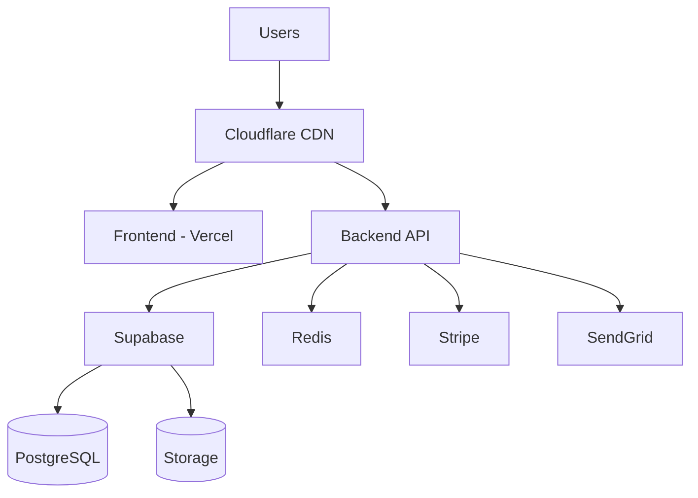

# V2 Resort - Disaster Recovery Plan

## Document Information

| Field | Value |
|-------|-------|
| Version | 1.0 |
| Last Updated | 2024 |
| Classification | CONFIDENTIAL |
| Review Frequency | Quarterly |

## 1. Executive Summary

This document outlines the disaster recovery (DR) procedures for the V2 Resort platform. It defines Recovery Time Objectives (RTO) and Recovery Point Objectives (RPO) for all critical systems, details recovery procedures, and establishes the responsibilities of the DR team.

## 2. Recovery Objectives

### 2.1 Critical Systems Classification

| System | Tier | RTO | RPO | Description |
|--------|------|-----|-----|-------------|
| PostgreSQL Database | Tier 1 | 1 hour | 5 minutes | Core data store |
| Authentication Service | Tier 1 | 30 minutes | 0 | User login capability |
| Payment Processing | Tier 1 | 30 minutes | 0 | Stripe integration |
| Backend API | Tier 1 | 1 hour | N/A | Core business logic |
| Frontend Application | Tier 2 | 2 hours | N/A | User interface |
| Real-time Messaging | Tier 2 | 2 hours | 1 hour | Socket.io/WebSocket |
| Email Service | Tier 3 | 4 hours | N/A | Notification delivery |
| Analytics/Reporting | Tier 3 | 8 hours | 24 hours | Non-critical reporting |

### 2.2 Objective Definitions

- **RTO (Recovery Time Objective)**: Maximum acceptable time to restore service
- **RPO (Recovery Point Objective)**: Maximum acceptable data loss measured in time

## 3. Backup Strategy

### 3.1 Database Backups

```yaml
# Supabase Backup Configuration
backup:
  frequency: continuous  # Point-in-time recovery
  retention:
    continuous: 7 days   # PITR retention
    daily: 30 days       # Daily snapshots
    weekly: 90 days      # Weekly snapshots
    monthly: 1 year      # Monthly archives
  location:
    primary: eu-central-1
    replica: us-east-1
  encryption: AES-256
```

**Backup Procedures:**
1. Continuous WAL (Write-Ahead Logging) archiving to S3
2. Daily logical dumps at 03:00 UTC
3. Weekly full backups on Sundays at 02:00 UTC
4. Monthly archives stored in Glacier

### 3.2 Application State Backups

| Component | Backup Method | Frequency | Location |
|-----------|--------------|-----------|----------|
| Redis Cache | RDB Snapshots | Hourly | S3 |
| File Uploads | Incremental Sync | Real-time | S3 Multi-region |
| Configuration | Git Repository | On Change | GitHub |
| SSL Certificates | Encrypted Archive | Weekly | Vault |

### 3.3 Infrastructure as Code

All infrastructure is defined in code and can be recreated:
- Terraform configurations in `/infrastructure`
- Docker Compose files for local/staging
- Kubernetes manifests for production

## 4. Disaster Scenarios

### 4.1 Database Failure

**Symptoms:**
- API returns 500 errors
- Connection timeout errors
- Data inconsistency reports

**Recovery Procedure:**

```bash
# Step 1: Identify the issue
supabase db status

# Step 2: If primary is down, promote replica
supabase db failover --region us-east-1

# Step 3: If data corruption, restore from backup
supabase db restore --point-in-time "2024-01-15T10:30:00Z"

# Step 4: Verify data integrity
npm run db:verify

# Step 5: Update connection strings if needed
./scripts/update-db-connections.sh
```

### 4.2 Complete Region Outage

**Pre-requisites:**
- Secondary region infrastructure ready
- DNS TTL set to 60 seconds
- Database replication active

**Recovery Procedure:**

```bash
# Step 1: Confirm primary region is unavailable
./scripts/health-check.sh primary

# Step 2: Activate secondary region
./scripts/failover-region.sh secondary

# Step 3: Update DNS to point to secondary
./scripts/update-dns.sh secondary

# Step 4: Notify stakeholders
./scripts/send-incident-notification.sh "Region failover initiated"

# Step 5: Monitor secondary region
./scripts/monitor-failover.sh
```

### 4.3 Security Breach

**Immediate Actions:**
1. Isolate affected systems
2. Revoke all access tokens
3. Rotate all secrets
4. Enable enhanced logging

```bash
# Emergency lockdown procedure
./scripts/emergency-lockdown.sh

# This script:
# - Invalidates all user sessions
# - Rotates JWT secrets
# - Enables IP blocklist
# - Activates honeypot logging
```

### 4.4 Ransomware Attack

**DO NOT:**
- Pay the ransom
- Negotiate with attackers
- Use infected systems

**Recovery Steps:**
1. Disconnect all systems from network
2. Identify patient zero and infection vector
3. Wipe and rebuild from known-good images
4. Restore data from offline backups
5. Implement additional security controls

## 5. Recovery Runbooks

### 5.1 Quick Reference Card

| Scenario | First Call | Escalation | Runbook |
|----------|-----------|------------|---------|
| Database Down | On-call DBA | CTO | DB-001 |
| API Outage | On-call Backend | Engineering Lead | API-001 |
| Payment Failure | On-call Backend | Finance + CTO | PAY-001 |
| Security Incident | Security Lead | CTO + Legal | SEC-001 |
| Region Outage | On-call DevOps | CTO | REG-001 |

### 5.2 Database Recovery Runbook (DB-001)

```markdown
## Prerequisites
- [ ] Access to Supabase dashboard
- [ ] Database credentials
- [ ] Backup restoration permissions

## Steps

1. **Assess the situation** (5 minutes)
   - Check Supabase status page
   - Review error logs
   - Identify scope of impact

2. **Attempt connection reset** (5 minutes)
   - Restart connection pools
   - Check network connectivity
   - Verify credentials

3. **If corruption detected** (15-60 minutes)
   - Stop write operations
   - Identify last known good state
   - Initiate point-in-time recovery
   - Verify data integrity

4. **Communication**
   - Update status page
   - Notify affected users
   - Brief stakeholders

5. **Post-recovery**
   - Document root cause
   - Update runbook if needed
   - Schedule post-mortem
```

## 6. Communication Plan

### 6.1 Internal Communication

| Role | Contact Method | Escalation Time |
|------|---------------|-----------------|
| On-call Engineer | PagerDuty | Immediate |
| Engineering Lead | Phone + Slack | 15 minutes |
| CTO | Phone + Email | 30 minutes |
| CEO | Phone | 1 hour (Tier 1 only) |

### 6.2 External Communication

**Status Page Updates:**
- Initial acknowledgment: Within 15 minutes
- Updates: Every 30 minutes during incident
- Resolution notice: Upon completion

**Customer Communication Templates:**

```text
INVESTIGATING:
We are currently investigating issues with [SERVICE]. 
Our team is actively working to identify and resolve the problem.
We will provide updates every 30 minutes.

IDENTIFIED:
We have identified the cause of the [SERVICE] issues.
Our team is implementing a fix. Expected resolution: [TIME].

RESOLVED:
The issues with [SERVICE] have been resolved.
All systems are now operating normally.
We apologize for any inconvenience caused.
```

## 7. DR Testing Schedule

### 7.1 Test Types

| Test Type | Frequency | Duration | Scope |
|-----------|-----------|----------|-------|
| Backup Verification | Weekly | 1 hour | Automated |
| Tabletop Exercise | Monthly | 2 hours | Team discussion |
| Partial Recovery | Quarterly | 4 hours | Single component |
| Full DR Drill | Annually | 8 hours | Complete failover |

### 7.2 Test Checklist

```markdown
## Pre-Test
- [ ] Notify all stakeholders
- [ ] Confirm test environment ready
- [ ] Brief participating team members
- [ ] Prepare rollback procedures

## During Test
- [ ] Document start time
- [ ] Record all actions taken
- [ ] Note any deviations from plan
- [ ] Time each recovery step

## Post-Test
- [ ] Calculate actual RTO/RPO
- [ ] Document lessons learned
- [ ] Update procedures as needed
- [ ] Schedule follow-up actions
```

## 8. Infrastructure Inventory

### 8.1 Production Services

| Service | Provider | Region | Redundancy |
|---------|----------|--------|------------|
| Database | Supabase | EU + US | Active-Passive |
| Backend API | Vercel/Render | Global Edge | Active-Active |
| Frontend | Vercel | Global Edge | Active-Active |
| CDN | Cloudflare | Global | Automatic |
| Email | SendGrid | US | N/A |
| Payments | Stripe | Global | Built-in |
| Monitoring | Sentry | US | N/A |

### 8.2 Critical Dependencies



## 9. Recovery Contacts

### 9.1 Internal Contacts

| Role | Name | Phone | Email |
|------|------|-------|-------|
| Primary On-call | Rotation | PagerDuty | oncall@v2resort.com |
| Engineering Lead | [Name] | [Phone] | [Email] |
| CTO | [Name] | [Phone] | [Email] |
| Security Lead | [Name] | [Phone] | [Email] |

### 9.2 Vendor Support

| Vendor | Support Level | Contact | SLA |
|--------|--------------|---------|-----|
| Supabase | Pro | support@supabase.com | 4 hours |
| Vercel | Enterprise | enterprise@vercel.com | 1 hour |
| Stripe | Premium | support@stripe.com | 2 hours |
| Cloudflare | Business | support@cloudflare.com | 2 hours |

## 10. Appendix

### A. Recovery Scripts

All recovery scripts are located in `/scripts/dr/`:

```
scripts/dr/
├── backup-verify.sh
├── db-failover.sh
├── db-restore.sh
├── emergency-lockdown.sh
├── failover-region.sh
├── health-check.sh
├── rotate-secrets.sh
├── send-notification.sh
└── update-dns.sh
```

### B. Change Log

| Version | Date | Author | Changes |
|---------|------|--------|---------|
| 1.0 | 2024-01 | DevOps Team | Initial version |

### C. Document Approval

| Role | Name | Signature | Date |
|------|------|-----------|------|
| CTO | | | |
| Engineering Lead | | | |
| Security Lead | | | |
