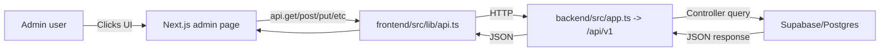

<!-- Last updated: 2026-05-10 -->

# Admin Architecture

> **Admin Pages:** 69 | **Admin Endpoints:** 78 | **Modules:** 37 | **Engines:** 4

This document describes how the Next.js admin UI flows end-to-end through the frontend API client, into the Express backend routers/controllers, through the 4-engine transaction framework, and finally into Supabase/Postgres. It is used as a shared reference for sectoring pages and for building automated contract/E2E tests.

## 1) UI layer (Next.js)

Admin pages are implemented as Next.js route modules under:

- `v2-resort/frontend/src/app/admin/*`
- dynamic module pages:
  - `v2-resort/frontend/src/app/admin/[slug]/*/page.tsx`

Each admin page:

1. Derives the current module from the URL slug (for `[slug]` pages).
2. Fetches required data from backend endpoints using the shared API client (`frontend/src/lib/api.ts`).
3. Renders tables/forms and wires buttons to HTTP calls (GET for lists, POST/PUT/PATCH/DELETE for mutations).

## 2) State & module context

Most admin pages use `useSiteSettings()` to load the “site context” needed to call module-scoped endpoints, typically including:

- active module records
- settings needed by the UI

`useSiteSettings()` loads:

- `GET /api/settings`
- `GET /api/modules?activeOnly=true`

These calls establish which modules are available and which module (template) the current `[slug]` page should operate on.

## 3) API client (Axios + auth + CSRF)

All admin pages use the shared Axios client:

- `v2-resort/frontend/src/lib/api.ts`

Key behaviors:

- `baseURL` is `${API_BASE_URL}/api/v1` (cookies enabled via `withCredentials: true`).
- request interceptor attaches the bearer access token from `localStorage` and ensures a valid CSRF token is available before mutations.
- CSRF token acquisition:
  - If no `csrf-token` cookie exists, the client fetches a fresh token from:
    - `GET /api/csrf-token`
  - This endpoint is hosted by the Express app at `backend/src/app.ts`.

## 4) Backend routing (Express)

The Express server wires all API mounts in:

- `v2-resort/backend/src/app.ts`

Important mount points (conceptually):

- `/api/v1/admin/*` is mounted via:
  - `apiRouter.use('/admin', adminRoutes)` (78 endpoints confirmed)
- module APIs are mounted under their module namespaces:
  - `/api/v1/accommodations/*` (time_exclusive_reservation engine)
  - `/api/v1/analytics/*` (unified engine metrics)
  - `/api/v1/bookings/*` (time_exclusive_reservation engine)
  - `/api/v1/payments/*` (unified payment intent across 4 engines)
  - `/api/v1/inventory/*` (shared_capacity_access engine)
  - etc.

The backend uses authentication/authorization middleware to protect admin routes:

- `authenticate` enforces the request is logged in
- `authorize(...)` enforces required roles (e.g. admin/super_admin)

## 4.1) Engine Framework Integration

Admin operations flow through the 4-engine transaction framework:

- **instant_transaction**: POS orders, food service operations
- **time_exclusive_reservation**: Multi-day bookings, accommodation management
- **shared_capacity_access**: Session-based access (pool, gym capacity)
- **ongoing_entitlement**: Subscriptions, memberships

All engine operations use the unified `transactions` table with engine-specific state machines.

## 5) Controllers & DB (Supabase/Postgres)

Once a request reaches a controller:

1. The controller reads the request payload/query params.
2. The controller queries/writes Supabase tables (Postgres backing).
3. The controller responds with JSON in the `{ success: boolean, data: ... }` pattern used by the frontend.

## 6) Auth + CSRF correctness

Because the admin UI supports mutations, CSRF correctness is part of the “working” definition for admin pages:

- On the frontend, the API client must have a valid `csrf-token` cookie.
- The backend applies CSRF protection globally (`csurfProtection`).
- For destructive operations (delete/approve/reset), the tests should verify both:
  - the request is sent
  - the backend accepts it (2xx) and the DB effect matches expectation

## Mermaid: Shared data-flow diagram

## 7) Test mapping implications

When sectoring and writing tests, use this doc to decide what to assert:

- UI load smoke: page route renders and triggers expected GET calls
- button-to-endpoint contract: clicking a button results in an HTTP call to the correct backend route
- DB effect verification: after mutation, verify the relevant record via a backend GET

