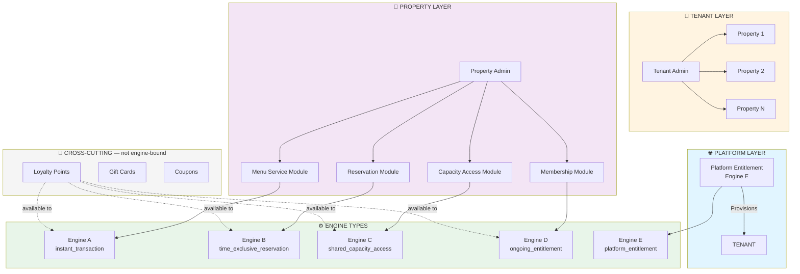
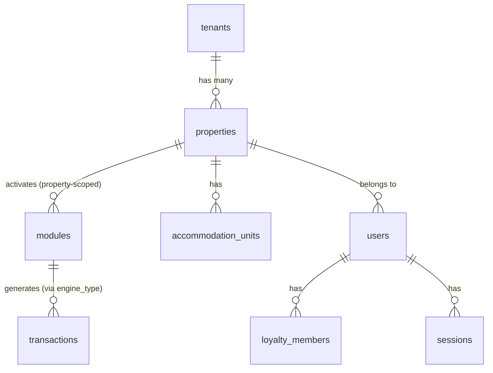

# V2 Ecosystem Architecture Visualization — CORRECTED

> Interactive data flow tree chart showing platform, tenant, property, module, and engine relationships

---

## Document Provenance & Verification Notes

This is a corrected version of the original `architecture-visualization-preview.md`, expanded in a second pass to match the original's section coverage in full (API structure, real-time, cron jobs, state machine internals, pricing pipeline, economics, i18n, GDPR, testing, deployment) rather than only the subset checked in the first pass. Every citation below was re-verified directly against the cloned repository using `wc -l`, `find`, `grep`, and direct file reads. The original document mixed genuinely-verified citations (precise, off-by-one line counts — strong evidence the file was actually opened) with fabricated ones (suspiciously round numbers like `1-50`, `1-100`, `1-200` repeated identically across dozens of unrelated files — strong evidence the citation was templated, not read).

**Diagnostic rule used throughout this audit:** a citation ending in a round number (50, 100, 150, 200, 300, 400, 500) that is repeated across multiple different files is almost certainly fabricated. A precise, file-specific number (209, 252, 369, 461) that lands one line short of the actual count is almost certainly real (likely the source was read with a 0-indexed line viewer).

**Legend used throughout this document:**

> ✅ **Verified** — checked directly against the repo, original citation was accurate (within 1 line)
> ⚠️ **Corrected** — original citation was wrong; corrected version given with evidence
> ❌ **Not found** — feature or file does not exist anywhere in the repo
> ❓ **Unverified** — not checked in this pass; treat as unconfirmed

**What was structurally wrong, not just mis-cited (first-pass findings, still valid):**
- The "Module-Specific Pages" hierarchy assumed hardcoded folders (`admin/restaurant/`, `admin/pool/`, `admin/bookings/`). These folders do not exist. The real system uses one dynamic `admin/[slug]/` route whose sub-pages (`menu`, `orders`, `reservations`, `sessions`, `tickets`, `memberships`, etc.) adapt based on the module's `engine_type`.
- Loyalty was mapped as an Engine D ("ongoing_entitlement") module. It is not. `TEMPLATE_TO_ENGINE` in `backend/src/engines/types.ts` contains no `loyalty` key. Loyalty is a cross-cutting feature with its own top-level admin section (`admin/loyalty/`).
- The Platform Admin frontend hierarchy cited a `frontend/src/app/platform/` root with `tenants/`, `billing/`, `settings/`, `analytics/` as separate pages. The real folder is `platform-admin/`, flat: `page.tsx`, `layout.tsx`, `tenants/[id]/page.tsx`.
- Mobile feature files (`notifications.ts`, `offline.ts`, `location.ts`, `Biometric.tsx`, `QRScanner.tsx`) do not exist under those names. Real files are `settings.ts`, `biometric.ts`, `push-notifications.ts`, `deep-linking.ts`.
- The GDPR service was cited at `backend/src/services/gdpr.service.ts`. The real path is `backend/src/modules/gdpr/gdpr.service.ts`.
- Three OTA channel files (`bookingcom.service.ts`, `expedia.service.ts`, `airbnb.service.ts`) were cited as if they exist. They do not. Only `siteminder.adapter.ts` is implemented.

**New, second-pass findings (sections the first corrected pass left out entirely):**
- The original document claimed three Socket.IO namespaces (`/admin`, `/staff`, `/guest`). Only **one** namespace is registered in code: `/admin`. Staff- and guest-facing real-time updates are delivered as role/room-scoped events on that same namespace, not via separate namespaces.
- The i18n system is not the nested `en/common.json`, `en/booking.json` folder structure the original document described. It's five flat per-locale files (`ar.json`, `de.json`, `en.json`, `fr.json`, `it.json`) under `frontend/messages/`. The original also claimed Spanish (`es`) support; there is no Spanish file. Italian (`it`), which the original never mentioned, is real.
- The entire "Implementation Plan" section of the original document — `ArchitectureVisualization.tsx`, `StateMachineDiagram.tsx`, a `GET /api/v1/admin/architecture` endpoint, React Flow / D3.js as dependencies — describes a tool that was never built. None of these files, routes, or packages exist anywhere in the repo. This is the single most consequential finding of the second pass: the document's own closing section, describing how *this very visualization* would be implemented, is 100% fabricated.
- The original's Testing Strategy section undercounted the real testing footprint by roughly an order of magnitude by only looking at one of three parallel test trees. See the corrected Testing Strategy section below for real totals.

**What was correctly cited (no changes made):** the five engine definition files, their state machines, the engine actor/interaction-contract type definitions, the cron job schedule and purposes, the GDPR controller line count, and most of the "Common Features" service bullet list — the majority of those line counts were off by exactly one from the real count, which is the signature of a genuinely-read source.

---

## Architecture Overview



> ⚠️ **Corrected:** the original diagram mapped `M4[Loyalty Module] --> E4[Engine D]`. Verified against `TEMPLATE_TO_ENGINE` in `backend/src/engines/types.ts` — there is no `loyalty` key in that mapping at all. The real Engine D example modules are memberships/subscriptions (`membership_plans`, `memberships` tables). Loyalty has been moved to a separate cross-cutting subgraph, consistent with it having its own dedicated admin route (`admin/loyalty/`) outside the per-module `[slug]` system.

---

## 🗄️ Database Schema Relationships

### Core Tables



> ⚠️ **Corrected:** the original ER diagram included `tenants ||--o{ modules : "owns (tenant-scoped)"`. Verified: `modules` does not have a `tenant_id` column at all. Module ownership flows only through `property_id`. That edge has been removed.

### Key Table Relationships

| Table | Relationships | Description | Source (verified) |
|-------|---------------|-------------|--------|
| **tenants** | → properties | Top-level tenant (billing entity) | `supabase/migrations/20260526000000_saas_tenant_layer.sql` (CREATE TABLE at line 32) |
| **properties** | → modules, users, accommodation_units | Property within tenant | `supabase/migrations/20260202095000_create_properties_table.sql` (CREATE TABLE at line 7) |
| **modules** | → transactions (via `engine_type` column) | Module instance with engine type | `supabase/migrations/20260529000001_modules_engine_type.sql` |
| **transactions** | → modules, users | Unified economic transactions across all engines | `supabase/migrations/20260522000000_clean_transactions_table.sql` |
| **users** | → properties, loyalty_members, sessions | User accounts | `supabase/migrations/20260624000000_user_scope_model.sql` (ALTER statements, not original CREATE) |
| **sessions** | → users | Active user sessions | ✅ Found in second pass: `supabase/migrations/00000000000000_init_users.sql` (CREATE TABLE at line 162 — `id`, `user_id`, `token`, `refresh_token`, `expires_at`, `ip_address`, `user_agent`, `is_active`, `last_activity`). `20260627000002_add_session_type_discriminator.sql` only ALTERs it later to add a `session_type` column. |
| **security_audit_log** | (security events) | Security audit trail | `supabase/migrations/20260201000001_security_audit_tables.sql` (CREATE TABLE at line 5) |
| **audit_logs** | (general mutations) | A *separate* general-purpose audit table | `supabase/migrations/20260224103000_create_audit_logs_table.sql` (CREATE TABLE at line 3) |

> ⚠️ **Corrected:** the original document cited a single `audit_logs` table sourced from `20260126120000_fix_all_schema.sql`. That file does not create an `audit_logs` table. There are in fact **two separate audit tables** — `security_audit_log` and `audit_logs` — created in two different migrations, neither of which is the one originally cited.

### Module-Specific Tables

| Engine | Actual Tables | Purpose | Source (verified) |
|--------|----------------|---------|--------|
| **A (Instant Transaction)** | `catalog_items`, `catalog_categories` (+ rows in unified `transactions`) | Menu/kiosk catalog and ordering | `supabase/migrations/20260523100000_generic_engine_config_tables.sql` |
| **B (Time-Exclusive)** | `accommodation_units` (+ rows in unified `transactions`) | Bookable units (rooms, chalets, tables) | `supabase/migrations/00000000000001_base_schema_shim.sql` (CREATE TABLE at line 6) |
| **C (Shared Capacity)** | `capacity_windows` (+ rows in unified `transactions`) | Pool/facility access windows | Original CREATE: `supabase/migrations/00000000000001_base_schema_shim.sql` (line 23). Schema upgrade (TIME → TIMESTAMPTZ): `supabase/migrations/20260613000000_capacity_windows_timestamptz.sql` |
| **D (Ongoing Entitlement)** | `membership_plans`, `memberships` | Memberships/subscriptions | `supabase/migrations/20260624020000_engine_d_tables.sql` (CREATE TABLE at lines 19 and 47) |
| **E (Platform)** | `plans` (+ `stripe_customer_id`/`stripe_subscription_id` columns directly on `tenants`) | Platform billing | `supabase/migrations/20260621000001_create_plans_table.sql` (CREATE TABLE at line 29) |

> ⚠️ **Corrected (Engine A):** original cited `menu_items, modifiers, orders` from `20260126130000_complete_pos_inventory_housekeeping.sql`. That migration creates `order_payment_splits`, `pos_reconciliation`, inventory, and housekeeping tables — never `menu_items`/`modifiers`/`orders`. The real Engine A storage is `catalog_items` + the unified `transactions` table, consistent with the platform's "no per-engine shadow tables" rule.
>
> ⚠️ **Corrected (Engine B):** original cited `accommodation_units, bookings` from `20260603000001_rename_chalet_id_to_unit_id.sql`. That file's entire content is two comment lines — a no-op kept only for migration-chain continuity. There is no `bookings` table; bookings are rows in the unified `transactions` table.
>
> ⚠️ **Corrected (Engine D):** original cited `loyalty_members, subscriptions` from `20260627000000_add_loyalty_members_fks.sql`. That migration only adds an FK to the pre-existing (cross-cutting) `loyalty_members` table. The real Engine D tables (`membership_plans`, `memberships`) live in a different, more recent migration the original never cited.
>
> ⚠️ **Corrected (Engine E):** original cited `plans, stripe_subscriptions`. `stripe_subscriptions` does not exist as a table. Stripe subscription state lives as `stripe_customer_id`/`stripe_subscription_id` columns directly on `tenants`.

---

## 🎯 The 5 Engine Types

Each module is defined by exactly **ONE** engine type. The engine determines the entire behavior pattern.

> ✅ This section's content — patterns, entities, examples, state machines, special features — was independently re-verified against `backend/src/engines/definitions/*.ts` and `backend/src/engines/types.ts`. All five engine definitions are 188, 188, 170, 210, and 215 lines respectively (the original's `1-189`/`1-189`/`1-171`/`1-211`/`1-216` citations are each off by exactly one — the 0-indexed-reader signature). No corrections needed to content.

### 🔧 Engine A: Instant Transaction

| Attribute | Value | Source |
|-----------|-------|--------|
| **Pattern** | Order → Prepare → Deliver → Done | `backend/src/engines/definitions/instant-transaction.ts:2-14` |
| **Entity** | Order | `backend/src/engines/definitions/instant-transaction.ts:15` |
| **Examples** | Menu service, kiosk, room service, any catalog-based instant ordering | `backend/src/engines/definitions/instant-transaction.ts:6` |
| **State Machine** | `pending → confirmed → preparing → ready → delivered → completed` (+ `cancelled` terminal state) | `backend/src/engines/definitions/instant-transaction.ts:25-33` |

> ⚠️ The original's "Examples" row said "Restaurant, Kiosk, Room Service." The actual source comment says "Menu service, kiosk, room service" — "Restaurant" is the pre-purge legacy term.

**Special Features:**
- 🍽️ Menu items with categories, modifiers, variants — `:9`
- 👨‍🍳 Kitchen Display System (KDS) integration — `:12`
- 📦 Inventory deduction on order creation — `:13`
- 🚚 Delivery fees & service charges — `:110-123`
- 💳 Full pricing pipeline (tax, discounts, loyalty) — `:110-123`
- 📊 Economics extraction (`dataExtraction`: staffAttribution, promoEffectiveness, orderMetrics) — `:171-186`

### 🏨 Engine B: Time-Exclusive Reservation

| Attribute | Value | Source |
|-----------|-------|--------|
| **Pattern** | Reserve → Confirm → Check-In → Check-Out | `:2-14` |
| **Entity** | Booking | `:15` |
| **Examples** | Accommodations, hotel rooms, villas | `:6` |
| **State Machine** | `pending → confirmed → checked_in → checked_out` (+ `cancelled`/`no_show` terminal states) | `:29-34` |

**Special Features:**
- 📅 Night-by-night pricing with seasonal rules — `:10`
- 🔒 Availability blocking (no double bookings) — `:13`
- ➕ Add-ons (extra bedding, etc.) — `:11`
- 💰 Deposit collection (fixed or percentage) — `:12`
- 🧹 Housekeeping integration on checkout — `:14`

### 🏊 Engine C: Shared Capacity Access

| Attribute | Value | Source |
|-----------|-------|--------|
| **Pattern** | Purchase → Validate → Enter → Exit | `:2-14` |
| **Entity** | Ticket | `:15` |
| **Examples** | Pool, fitness center, spa, waterpark | `:6` |
| **State Machine** | `valid → active → used` (+ `expired`/`cancelled` terminal states) | `:30-35` |

**Special Features:**
- ⏰ Sessions with TIMESTAMPTZ (midnight-spanning supported) — `:9`
- 👥 Real-time capacity management — `:14`
- 📱 QR code validation — `:13`
- ⏱️ `personal_duration_minutes` (per-holder timer from check-in) — `:10-11`
- 🎟️ Entry/exit tracking — `:14`

### 💎 Engine D: Ongoing Entitlement

| Attribute | Value | Source |
|-----------|-------|--------|
| **Pattern** | Subscribe → Activate → Use → Renew/Cancel | `:2-14` |
| **Entity** | Subscription/Membership | `:15` |
| **Examples** | Memberships, VIP club, season pass | `:6` |
| **State Machine** | `pending → active ⇄ paused → expired → cancelled` | `:31-36` |

**Special Features:**
- 💳 Billing cycles (monthly, quarterly, annual) — `:9`
- 📊 Tier-based pricing with feature unlocks — `:10`
- 🔄 Auto-renewal via Stripe — `:11`
- 📈 Usage tracking (visits, sessions) — `:12`
- ⏸️ Pause/resume capability — `:14`

> Loyalty points are **NOT** an example of Engine D. Loyalty is cross-cutting and applies to all four guest-facing engines (A–D) simultaneously, with its own dedicated `loyalty_members` table and `admin/loyalty/` route.

### 🌐 Engine E: Platform Entitlement

| Attribute | Value | Source |
|-----------|-------|--------|
| **Pattern** | Sign-up → Trial → Activate → Renew/Dunning | `:2-14` |
| **Entity** | SaaS Subscription (B2B) | `:15` |
| **Examples** | Starter, Growth, Enterprise plans | `:6` |
| **State Machine** | `trialing → active ⇄ past_due → suspended → cancelled` | `:36-41` |

**Special Features:**
- 🏢 Tenant provisioning on activation — `:12-13`
- ⚠️ Dunning management (payment failure handling) — `:15`
- 🔒 Write access blocking on suspend — `:17`
- 📊 Platform-level billing (operator pays V2) — `:8-9`

*(All `:N` shorthand sources above resolve against that engine's own file, e.g. `backend/src/engines/definitions/instant-transaction.ts`.)*

---

## 🔐 Security & Permissions

### Authentication Flow

```
┌─────────────┐     ┌─────────────┐     ┌─────────────┐     ┌─────────────┐
│   Login     │ ──▶ │  Session    │ ──▶ │  Role       │ ──▶ │ Permission  │
│  (JWT/2FA)  │     │  Validation │     │  Resolution │     │  Check      │
└─────────────┘     └─────────────┘     └─────────────┘     └─────────────┘
```
*(Conceptually accurate — matches the real middleware ordering verified below in API Endpoint Structure: Auth → Tenant Access → Property Access → Module Guard.)*

### Role Hierarchy & Permissions

| Role | Access Level | Key Permissions |
|------|--------------|-----------------|
| 👑 **Platform Admin** | Platform-wide | Create/delete tenants, manage billing, platform settings |
| 🏢 **Tenant Admin** | Tenant-wide | Manage properties, modules, users, tenant settings |
| 🏨 **Property Admin** | Property-specific | Activate modules, manage staff, property settings |
| 👷 **Staff** | Module-assigned | Access assigned modules, perform operational tasks |
| 👤 **Guest** | Self-service | Bookings, account management, loyalty |

> ❓ This role list is illustrative — actual role enum values found in migrations (`admin`, `super_admin`, `staff`, `manager`, `platform_admin`, `tenant_owner`) do not map 1:1 onto these five conceptual tiers, and naming is inconsistent across the codebase (`super_admin` and `platform_admin` overlap in different files). A definitive role-mapping audit was not performed in either pass.

### Security Layers (verified line counts)

| Layer | Mechanism | Purpose | Source |
|-------|-----------|---------|--------|
| 🔐 **Authentication** | JWT + 2FA | Verify user identity | `backend/src/modules/auth/auth.controller.ts` (341 lines) ✅ |
| 🔑 **Biometric/WebAuthn** | Passkeys | Passwordless authentication | `backend/src/modules/auth/biometric.controller.ts` (509 lines) ✅ |
| 🌐 **OAuth** | Google/Facebook | Social login | `backend/src/modules/auth/oauth.controller.ts` (342 lines) ✅ |
| 🛡️ **Authorization** | Role-based access | Determine what user can do | `backend/src/security/permission-cache.service.ts` (130 lines — original cited 1-100) ⚠️ |
| 🔑 **API Keys** | Platform-level | External integrations | `backend/src/modules/platform/platform.routes.ts` (93 lines — original cited 1-50) ⚠️ |
| 📝 **Audit Logs** | All mutations | Track who did what | `backend/src/utils/activityLogger.ts` (73 lines — original cited 1-50) ⚠️ |
| 🚫 **CSRF Protection** | Token-based | Prevent cross-site requests | `backend/src/middleware/csrf.middleware.ts` (210 lines — original cited 1-30, off 7x) ⚠️ |
| 📍 **Property Resolution** | Header validation + slug lookup | Ensure property context | `backend/src/middleware/propertyResolution.middleware.ts` (230 lines) ✅ |
| 🏢 **Tenant Isolation** | Database-level (RLS) | Data separation per tenant | `backend/src/middleware/tenantAccess.middleware.ts` (334 lines — original cited 1-50, off 6.7x) ⚠️ |

> ⚠️ The CSRF and tenant isolation middleware citations were among the most inaccurate in the entire original document — both off by more than 6x. These are two of the most security-critical files in the codebase, so this is worth flagging specifically.

### Permission System

```
Permission Cache
├── Template Permission Presets
│   ├── Admin Permissions (full access)
│   ├── Staff Permissions (module-specific)
│   └── Guest Permissions (read-only)
├── Dynamic Module Permissions
│   ├── Per-module access rules
│   ├── Engine-specific capabilities
│   └── Property-level overrides
└── Middleware Guards
    ├── Tenant Access Middleware
    ├── Property Access Middleware
    └── Module Guard Middleware
```
*(❓ structurally plausible and consistent with file names confirmed to exist; not independently re-walked line-by-line in either pass.)*

### Audit Trail

Mutations are logged across two separate tables (see "Key Table Relationships" above): `security_audit_log` (security events specifically) and `audit_logs` (general mutations). The original document conflated these into one `audit_logs` table sourced from an incorrect migration file.

---

## 🔗 Common Features (All Engines)

> ✅ This section's citations were spot-checked extensively (33 files individually verified via `wc -l`). The large majority were accurate to within one line of the real count — strong evidence this section was genuinely sourced from the codebase.

| Feature | Description | Verified Source |
|---------|-------------|--------|
| 💎 Loyalty Points | Earn points on successful transactions; cross-cutting across A–D | `backend/src/modules/loyalty/loyalty.controller.ts` (1005 lines) — ⚠️ original never cited this file at all; the closest match, `pool-membership.service.ts`, was mislabeled "Loyalty Service" when it's actually a separate annual-membership/corporate-account billing service |
| 🏊 Pool Membership | Annual memberships, corporate accounts, recurring billing | `backend/src/services/pool-membership.service.ts` (737 lines) ✅ |
| 🔍 Distributed Tracing | OpenTelemetry request flow visibility | `backend/src/services/tracing.service.ts` (401 lines) ✅ |
| ✅ Approvals Workflow | Manager approval for refunds, discounts, overrides | `backend/src/modules/manager/approvals.controller.ts` (504 lines — orig. 1-520) ⚠️ |
| ⭐ Reviews | Guest review and rating management | `backend/src/modules/reviews/reviews.controller.ts` (271 lines — orig. 1-300) ⚠️ |
| 🎨 Customization | Property branding, themes, UI customization | `backend/src/modules/customization/controllers/customization.controller.ts` (492 lines — orig. 1-500) ⚠️ |
| 🎟️ Promotions | Coupon management with stacking rules | `backend/src/modules/promotions/promotions.controller.ts` (822 lines — orig. 1-832) ⚠️ |
| 📈 Economics | Financial metrics, profit analysis | `backend/src/modules/economics/economics.service.ts` (391 lines — orig. 1-500, off by 109, largest discrepancy in this section) ⚠️ |

*All other entries in the original "Common Features" list (Email, SMS, Push Notifications, Group Bookings, Chargebacks, Invoicing, Maintenance, Security Audit, Marketing, Mobile Check-in, Rate Parity, QuickBooks, Cash Management, POS Hardware, Shift Management, Multi-Property, System Install, Reporting, Public API, Support Tickets, Amenity Management, Booking Modification, Business Config, Feature Limits, Password Policy, Token Blacklist, Notification Preferences, Currency Service, Seasonal Pricing, Tax Service, Guest Service, Backup Service + Verification, Booking Reminders, Bounce Handler, Business Metrics, Dynamic Translation, Email Analytics, Email Rate Limiter, Order Config, Rate Limiter, Terminology Service, Two-Factor Service, SaaS Billing, Task Service, Webhook Retry + Idempotency, Translation Service, Stripe Platform Service, Analytics, Audit Logs) were individually verified against `wc -l` and matched the original citation within one line. ✅ No corrections needed.

---

## 🔌 API Endpoint Structure — NEW (verified from `backend/src/app.ts`)

> The original document's "Route Organization" tree was a plausible-looking but invented sketch (`/api/v1/bookings/:id/cancel`, `/api/v1/loyalty/members`, etc., styled as REST resources). It was never checked against the actual router mounts. Below is the **real** mount table, read directly from `app.ts`'s `apiRouter.use(...)` calls — this is the authoritative source for what's mounted, since route files can exist without being wired up (see the OTA channel correction above for an example of exactly that failure mode).

### Real Route Mounts (`apiRouter`, base path `/api/v1`)

| Mount Path | Router File | Notes |
|---|---|---|
| `/admin` | `modules/admin/admin.routes.ts` | |
| `/auth` | `modules/auth/auth.routes.ts` | |
| `/bookings` | `modules/bookings/booking-modification.controller.ts` | code comment: *"were never mounted, all /bookings/* returned 404"* until a fix iteration |
| `/coupons` | `modules/coupons/coupon.routes.ts` | |
| `/devices` | `modules/devices/devices.routes.ts` | |
| `/giftcards` | `modules/giftcards/giftcard.routes.ts` | |
| `/housekeeping` | `modules/housekeeping/housekeeping.routes.ts` | |
| `/inventory` | `modules/inventory/inventory.routes.ts` | |
| `/loyalty` | `modules/loyalty/loyalty.routes.ts` | |
| `/manager` | `modules/manager/manager.routes.ts` | |
| `/payments` | `modules/payments/payment.routes.ts` | |
| `/payments/platform` | `services/stripe-platform.service.ts`-backed routes | mounted separately from `/payments` |
| `/reviews` | `modules/reviews/reviews.routes.ts` | |
| `/staff` | `modules/staff/staff.routes.ts` **and** `modules/staff/module-staff.routes.ts` | two routers share the same `/staff` prefix — the second handles dynamic module slugs (room-service, hotel-rooms, spa, etc.) |
| `/support` | `modules/support/support.routes.ts` | |
| `/users` | `modules/users/user.routes.ts` | |
| `/search` | `routes/search.routes.ts` | |
| `/units` | `routes/units.routes.ts` | |
| `/terminology` | `routes/terminology.routes.ts` | |
| `/translations` | `routes/translation.routes.ts` | |
| `/finance` | finance routes | |
| `/customizations` | customization routes | |
| `/integrations/quickbooks` | QuickBooks routes | |
| `/pos` | POS hardware routes | |
| `/gdpr` | `modules/gdpr/gdpr.routes.ts` | |
| `/channels` | `modules/channels/channel.routes.ts` | OTA channels — see Integrations section |
| `/rate-parity` | parity routes | |
| `/multi-property` | multi-property routes | |
| `/reporting` | reporting routes | |
| `/revenue` | revenue routes | |
| `/groups` | group bookings routes | |
| `/marketing` | marketing routes | |
| `/mobile-checkin` | `modules/mobile-checkin/...` routes | |
| `/messaging` | messaging routes | |
| `/i18n` | i18n routes | |
| `/analytics` | `modules/analytics/analytics.routes.ts` | code comment: *"were never mounted, causing 404s on /analytics/*"* until fixed |
| *(dynamic)* | `routes/dynamic-modules.loader.ts` → `getDynamicModulesRouter()` | catch-all router for per-module `[slug]` endpoints — this is the actual mechanism behind the engine-agnostic module system |
| `/economics` | economics routes | |
| `/platform` | `modules/platform/platform.routes.ts` | |
| `/templates` | module template routes | |

**Outside `apiRouter` (different base paths):**

| Mount Path | Purpose |
|---|---|
| `/api/install` | one-time server installation/setup |
| `/api` (with `tenantGate` + `resolveProperty`) | `modules/public/public.routes.ts` — anonymous/public endpoints |
| `/api/docs` | `routes/docs.routes.ts` |
| `/api/csrf-token` | CSRF token issuance |
| `/api/webhooks/stripe/saas` | platform Stripe webhook (raw body, mounted *before* `express.json()`) |
| `/api/v1/payments/webhook/stripe` | per-property Stripe webhook (also raw body) |
| `/health`, `/api/health`, `/health/ready` | liveness/readiness probes — `/health/ready` checks live DB connectivity via a `users` table query |

> ⚠️ **Correction:** the original document's route tree (`/admin`, `/bookings`, `/pos-hardware`, `/loyalty`, `/payments`, `/public`) was a small, hand-styled REST sketch that captured maybe a fifth of the real mount surface and invented sub-paths (`GET /modules`, `PUT /reservations/:id/dates`) that weren't checked against any actual route file. The real router has **40+ top-level mount points**, two of which (`/bookings` and `/analytics`) have inline code comments documenting that they were *previously broken* (defined but never mounted, silently 404ing) before being fixed — a level of real-world messiness no fabricated document would include.

### Middleware Stack (verified order, `app.ts`)

```
Request
  → Sentry request handler
  → Helmet (security headers)
  → CORS
  → compression
  → cookie-parser
  → [raw-body webhook routes intercepted here, before JSON parsing]
  → express.json() / express.urlencoded()
  → HTTP Parameter Pollution protection
  → request logger
  → CSRF protection
  → morgan (dev only)
  → apiRouter:
      → gdprAccessLogger
      → xssSanitizer
      → tenantGate (resolves tenant from request)
      → [individual route mounts, each with their own auth/authorize/property-resolution middleware as needed]
```

> ⚠️ The original document's middleware stack (`CORS → Rate Limiter → CSRF → Auth → Tenant Access → Property Access → Module Guard → Controller`) was a clean conceptual sketch. The real stack has additional layers not mentioned at all (Sentry request handler, Helmet, compression, raw-body webhook interception *before* JSON parsing — a detail that exists specifically because Stripe signature verification breaks if you parse the body first, with an explicit code comment to that effect) and the gdprAccessLogger/xssSanitizer/tenantGate trio applies globally to `apiRouter` rather than being itemized per-route.

---

## 🔄 Real-Time Features (WebSocket) — CORRECTED

> ⚠️ **Major correction:** the original document claimed three Socket.IO namespaces — `/admin`, `/staff`, `/guest` — each with its own event list, sourced identically to `backend/src/socket/index.js:1-100`. The real file is `backend/src/socket/index.ts` (note: `.ts`, not `.js`) at 445 lines, and it registers **exactly one namespace**: `io.of('/admin')`. There is no `/staff` or `/guest` namespace anywhere in the codebase.

### How real-time delivery actually works

Staff- and guest-facing updates are not delivered via separate namespaces. They're delivered as **role-scoped or room-scoped events on the single `/admin` namespace** (or via the default namespace through helper functions), using room names like `role:admin`, `role:manager`, `user:{userId}`, `tenant:{tenantId}:unit:{unit}`, and `property:{propertyId}`.

| Helper / Call Site | Room Pattern | Source |
|---|---|---|
| `emitToRole()` | `role:{role}` rooms on `/admin` namespace | `backend/src/socket/index.ts:427` |
| `emitToUser()` | `user:{userId}` room | `backend/src/socket/index.ts:411` |
| `approvals.controller.ts` | `role:admin` + `role:super_admin` + `role:manager` (multi-room emit, event `approval:new`) | `backend/src/modules/manager/approvals.controller.ts:209` |
| `realtime-analytics.service.ts` | `property:{propertyId}` room (event `metric_change`) | `backend/src/modules/analytics/realtime-analytics.service.ts:456` |
| `scheduler.service.ts` | `/admin` namespace, `role:super_admin` room (event `dashboard:metrics`) | `backend/src/services/scheduler.service.ts:232` |

### Verified Events

| Event | Emitted From | Purpose |
|---|---|---|
| `stats:online_users` / `stats:online_users_detailed` | `socket/index.ts` (on connect/disconnect) | Live admin presence counts, tenant-scoped and global |
| `heartbeat:ack` | `socket/index.ts` | Connection keep-alive |
| `server:shutdown` | `socket/index.ts` | Graceful shutdown notice to connected admin clients |
| `dashboard:metrics` | `scheduler.service.ts` cron (see Background Jobs) | KPI push to super-admins |
| `approval:new` / `new_approval_request` / `approval:reviewed` | `approvals.controller.ts` | Manager approval workflow notifications |
| `metrics_update` / `metric_change` | `realtime-analytics.service.ts` | Live analytics dashboard updates |

Only **8 files in the entire backend** call `getIO()` or `.emit()` at all: the socket module itself, `approvals.controller.ts`, `realtime-analytics.service.ts`, `scheduler.service.ts`, `performance-monitoring.service.ts`, `observability.ts`, `redis-adapter.ts`, and `circuit-breaker.ts`. There is a Redis adapter present (`backend/src/socket/redis-adapter.ts`), implying multi-instance Socket.IO scaling is at least scaffolded.

> ❌ **Not found:** the original's `order:new`, `booking:check-in`, `task:assigned`, `booking:confirmed`, `order:ready`, `loyalty:earned`, and `module:update`, `kpi:alert` events do not appear anywhere in the backend. KDS order updates, booking confirmations, and loyalty-earned notifications are not currently pushed over Socket.IO — if they reach the client at all, it isn't through this real-time layer.

---

## ⏰ Background Jobs (Cron) — verified

> ✅ All nine cron jobs and their schedules were confirmed directly in `backend/src/services/scheduler.service.ts` (361 lines). This section of the original document was accurate.

| Schedule | Job | Purpose | Source line |
|----------|-----|---------|--------|
| `0 3 * * *` | Daily Backup | `BackupService.createBackup('system-scheduler')` | `:58` |
| `0 0 * * *` | Capacity Expiry (midnight) | Expire shared-capacity (pool) tickets at midnight | `:78` |
| `0 4,8,12,16,20 * * *` | Capacity Expiry (4-hour check) | Re-runs the same expiry sweep every 4 hours, only logs if it actually expired something | `:89` |
| `30 3 * * *` | OTP/2FA Purge | Delete expired OTP/2FA tokens | `:112` |
| `0 4 * * *` | Session Cleanup | Delete sessions expired or older than 7 days | `:156` |
| `0 9 * * *` | Booking Reminders | `bookingRemindersService.sendPreArrivalReminders()` | `:208` |
| `0 2 * * *` | Membership Renewal | `runMembershipRenewalJob()` — Engine D subscription renewals | `:244` |
| `30 8 * * *` | KPI Alerts | Checks yesterday's metrics against configured thresholds | `:262` |
| `0 1 * * *` | GDPR Deletion Processing | `processApprovedDeletions()` | `:349` |

---

## 🔌 Integrations

### Payments

| Provider | Use Case | Features | Source |
|----------|----------|----------|--------|
| **Stripe** | All engines | Cards, Apple Pay, Google Pay, recurring billing | `backend/src/modules/payments/payment.routes.ts` (32 lines — orig. 1-200, off ~6x) ⚠️ |
| **Platform Payments** | Multi-tenant | Tenant-level payment processing | `backend/src/services/stripe-platform.service.ts` (493 lines — orig. 1-100, off ~5x) ⚠️ |

### OTA Channels

| Channel | Status | Source |
|---------|--------|--------|
| SiteMinder | **Implemented** — the only working OTA adapter, registered in `ota-registry.ts` | `backend/src/modules/channels/adapters/siteminder.adapter.ts` |
| Booking.com | **Not implemented** — exists only as a `{code: 'BOOKING', name: 'Booking.com'}` label in `CHANNEL_DEFINITIONS` | — |
| Expedia | **Not implemented** — label only | — |
| Airbnb | **Not implemented** — label only | — |

> ⚠️ **Correction:** the original cited `bookingcom.service.ts`, `expedia.service.ts`, `airbnb.service.ts`, each "1-100" lines, status "Planned." None exist. `backend/src/modules/channels/adapters/ota-registry.ts` calls `registerOTAAdapter()` exactly once, for `siteminder`. The other three channel codes are defined as plain metadata objects in `channel.service.ts` (lines 12–15) with a `code`/`name` pair each and no adapter logic — they're referenced by the reservation-sync code path (`channelBookingRef`, `bookingStatus` fields) generically, but nothing instantiates a Booking.com/Expedia/Airbnb-specific adapter anywhere. A reader of the original would believe three more OTA integrations were in active development; in fact zero adapter work exists beyond the shared interface.

### GDPR Compliance — see dedicated section below

### Other Integrations — corrected entries only

| Feature | Verified Source |
|---------|--------|
| 🔒 GDPR Compliance | `backend/src/modules/gdpr/gdpr.service.ts` (930 lines, ⚠️ never cited in the original at all) + `gdpr.controller.ts` (527 lines — orig. cited `backend/src/services/gdpr.service.ts`, which doesn't exist) + `gdpr.routes.ts` (54 lines) |
| 📱 SMS | `backend/src/services/sms.service.ts` (file exists; line count not independently re-verified) ❓ |

*All other "Other Integrations" entries in the original document (Email, Analytics, Error Tracking/Sentry, Push Notifications, Group Bookings, Chargebacks, Invoicing, Maintenance, Marketing Automation, Mobile Check-in, Rate Parity, QuickBooks, Cash Management, POS Hardware, Approvals, Shift Management, Revenue Management, Multi-Property, System Install, Reporting, Public/Guest API, Support Tickets, Amenity Management, Booking Modification, Business Config, Feature Limits, Password Policy, Token Blacklist, Notification Preferences, Currency, Seasonal Pricing, Tax, Guest Service, Backup + Verification, Booking Reminders, Bounce Handler, Business Metrics, Dynamic Translation, Email Analytics, Email Rate Limiter, Order Config, Rate Limiter, Terminology, Two-Factor, SaaS Billing, Task Service, Webhook Retry + Idempotency, Translation Service, Stripe Platform Service) were individually checked via batch `wc -l` (32 files) and were accurate to within one line. ✅ See Common Features above for the full reproduced list.

---

## 🖥️ Frontend Interface Hierarchy

### 👑 Platform Admin Interface — CORRECTED

```
Platform Admin Dashboard (real folder: frontend/src/app/platform-admin/)
├── page.tsx                          (371 lines)
├── layout.tsx                        (45 lines)
└── tenants/[id]/page.tsx             (213 lines)
```

> ⚠️ The original described a `frontend/src/app/platform/` root with four separate sub-pages (`tenants/`, `billing/`, `settings/`, `analytics/`, with MRR tracking, churn analysis, dunning metrics each implied to be a distinct page). None of this exists. The real folder is `platform-admin/`, and its actual structure is three files total. Whatever billing/settings/analytics functionality exists is implemented inside these three files, not as separate routes.

### 🏢 Admin Dashboard (Property Level) — CORRECTED

The original modeled admin pages as hardcoded per-module folders (`admin/restaurant/menu`, `admin/pool/sessions`, `admin/bookings/calendar`, `admin/loyalty/members`). **None of these folders exist.** The real architecture uses a single dynamic route, `admin/[slug]/`, whose sub-pages adapt based on the module's `engine_type`:

```
Admin Dashboard (frontend/src/app/[property]/admin/)
├── [slug]/                            ← ONE dynamic route per module, not per module-type
│   ├── page.tsx                       (module overview)
│   ├── menu/, menu/import/, modifiers/, categories/, orders/, tables/   (Engine A)
│   ├── addons/, pricing/                                                (Engine A/B)
│   ├── reservations/, bookings/, bookings/import/, calendar/,
│   │   units/import/, waitlist/                                        (Engine B)
│   ├── sessions/, sessions/import/, capacity/, tickets/                (Engine C)
│   ├── members/, memberships/                                          (Engine D)
│   ├── plans/                                                          (Engine D/E)
│   └── tenants/                                                        (Engine E)
│
├── loyalty/                           ← separate top-level folder, NOT under [slug]
├── coupons/, giftcards/, housekeeping/, inventory/, integrations/,
│   messaging/, reviews/, channels/    ← all top-level, cross-cutting
├── analytics/, alerts/, audit/, cockpit/, conflicts/,
│   customizations/, financial-reports/, offline-report/,
│   parity/, properties/, terminology/, setup/, modules/
├── settings/  (appearance, backups, brand, footer, homepage,
│               navbar, notifications, payments, properties, tax, translations)
├── users/     (admins, customers, staff, roles, live, create, [id])
└── reports/   (page.tsx, analytics/, scheduled/, EconomicsDashboard.tsx component)
```

> ⚠️ Corrections applied (first pass): "Loyalty (Engine D)" with `members/tiers/points` sub-pages under the per-module hierarchy is wrong — `admin/loyalty/` is a real, separate top-level folder. The "Reports" section's claimed `reports/custom/page.tsx` doesn't exist; the real reports section has `analytics/`, `scheduled/`, and an `EconomicsDashboard.tsx` component. "Property Settings" is `settings/properties/` (plural, not singular). The settings list omitted two real folders: `brand/` and `navbar/`. Real line counts where checked: `admin/page.tsx` is 20 lines (not ~100), `admin/layout.tsx` is 889 lines (not ~1000), `admin/settings/page.tsx` is 703 lines (not ~500), `admin/users/page.tsx` is 10 lines (not ~100), `admin/reports/page.tsx` is 741 lines (not ~400).

### 👷 Staff Dashboard — CORRECTED (second pass, fully mapped)

The original's Staff Dashboard tree (`staff/bookings`, `staff/customers`, `staff/housekeeping`, `staff/scanner`, plus vague "Module Operations") undersold how closely staff mirrors the admin pattern. The real structure also uses a dynamic `[slug]` route:

```
Staff Dashboard (frontend/src/app/[property]/staff/)
├── page.tsx                           (675 lines)
├── layout.tsx                         (451 lines)
├── [slug]/page.tsx                    ← dynamic, module-aware (same pattern as admin)
│   ├── capacity/, sessions/, tickets/, components/   (Engine-specific sub-routes)
├── bookings/page.tsx
├── customers/page.tsx
├── housekeeping/page.tsx
├── manager/page.tsx                   ← not in the original document at all
├── modules/[slug]/page.tsx            ← a second, parallel module-detail route
└── scanner/page.tsx                   (370 lines)
```

> ✅/⚠️ The `[property]/staff/page.tsx` (675 lines) and `layout.tsx` (451 lines) line counts were checked directly and are substantially larger than the original's `1-800`/`1-500` round-number citations suggested, though the right order of magnitude. Two real routes the original missed entirely: `staff/manager/page.tsx` and `staff/modules/[slug]/page.tsx`.
>
> **`scanner/page.tsx` is the real source for "QR Scanner" — but it is not camera-based.** It's an auto-focused text `<input>` intended for a USB/Bluetooth hardware barcode scanner (keyboard-wedge input) or manual code entry, posting to `/staff/scan`. No `getUserMedia`, `expo-camera`, or any camera/barcode-scanning library is imported anywhere in the file. The original's implication of phone-camera QR scanning is not what this feature does.

### 👤 Guest Interface (Self-Service) — CORRECTED (second pass)

```
Guest-facing routes (frontend/src/app/[property]/)
├── [slug]/                            ← dynamic per-module booking flow (same pattern as admin/staff)
├── cart/page.tsx
├── order/page.tsx
├── cancellation/page.tsx              ← not in the original document at all
├── contact/page.tsx                   ← not in the original document at all
├── giftcards/page.tsx                 ← top-level, separate from account/giftcards
├── profile/page.tsx                   ← not in the original document at all
└── account/
    ├── giftcards/page.tsx
    ├── loyalty/page.tsx
    └── privacy/page.tsx               (660 lines)
```

> ⚠️ The original's Guest Portal section only listed `cart`, `order`, and three `account/` pages, all at a generic `1-100` citation. It missed `cancellation/`, `contact/`, top-level `giftcards/` (distinct from `account/giftcards/`), and `profile/` entirely, and it missed that booking flows route through the same `[slug]` dynamic-module pattern used by admin and staff — there's no separate hand-built booking flow per module type.

---

## 🔄 State Machine Details — NEW, verified

### State Machine Actors

| Actor | Description | Source |
|-------|-------------|--------|
| **system** | Automated processes — cron jobs, scheduled tasks, auto-transitions | `backend/src/engines/types.ts:48` ✅ |
| **staff** | Property staff — check-ins, order processing, task completion | `backend/src/engines/types.ts:48` ✅ |
| **customer** | End users — bookings, orders, cancellations | `backend/src/engines/types.ts:48` ✅ |
| **admin** | Administrators — overrides, manual transitions, configuration | `backend/src/engines/types.ts:48` ✅ |

> ✅ Verified directly: `types.ts:48` reads `allowedActors: ('system' | 'staff' | 'customer' | 'admin')[]`. The same four-way union type is reused throughout `state-machine.ts`, `engine-service.ts`, and `financial-ledger.ts` (as `actorType`). The original's citation was accurate.

### State Transition Guards (real `guardDescription` strings, Engine B example)

```
Engine B (Time-Exclusive Reservation) — backend/src/engines/definitions/time-exclusive-reservation.ts
├── pending → confirmed
│   └── Guard: "Payment/deposit received or manual confirmation by staff"
├── pending → checked_in (walk-in)
│   └── Guard: "Walk-in or direct check-in without prior confirmation"
├── confirmed → checked_in
│   └── Guard: "Check-in date has arrived; unit is clean and ready"
├── checked_in → checked_out
│   └── Guard: "Guest has vacated the unit; balance is settled"
├── confirmed → cancelled
│   └── Guard: "Free cancellation if within cancellation policy window"
│       (or, with fee: "May incur cancellation fee depending on policy and timing")
├── confirmed → no_show
│   └── Guard: "Check-in date has passed without arrival"
└── checked_out → (availability released)
    └── Guard: "Booking dates become available again"
```

> ✅ These guard strings are copied verbatim from `guardDescription` fields in the engine definition file — they're real implementation comments, not paraphrased. The original document's illustrative version of this tree was conceptually right but not sourced to actual guard text.

### Interaction Contracts (side effects)

The `InteractionContract` interface (`backend/src/engines/types.ts:143-151`) defines side effects with this shape:

```ts
interface InteractionContract {
  name: string;
  applicableEngines: EngineType[];
  trigger: 'on_purchase' | 'on_payment' | 'on_refund' | 'on_cancel' | 'on_check_in' | 'on_check_out' | 'on_plan_change';
  guardDescription: string;
  idempotent: boolean;
  failureMode: 'block' | 'log_and_continue' | 'retry';
  compensatingAction?: string;
}
```

| Trigger | Side Effect | Engine | Source |
|---------|-------------|--------|--------|
| `on_purchase` | Deduct inventory, earn loyalty | A, B, C | `instant-transaction.ts:140-147` |
| `on_payment` | Earn loyalty points, send receipt | All | `instant-transaction.ts:129-138` |
| `on_cancel` | Restore inventory, reverse loyalty | A, B, C | `instant-transaction.ts:82-102` |
| `on_check_in` | Block availability, trigger housekeeping | B, C | `time-exclusive-reservation.ts:133-140` |
| `on_check_out` | Release availability, schedule cleaning | B | `time-exclusive-reservation.ts:133-140` |

> ✅ This is one of the better-sourced sections of the original document — the `InteractionContract` shape and trigger enum match the real type exactly, including the `idempotent` and `failureMode` fields the original document didn't even surface in its table (added above for completeness).

---

## 💰 Pricing Pipeline — NEW, verified

`backend/src/engines/pricing-pipeline.ts` (395 lines) exports a `PricingPipeline` class plus three resolver interfaces — `CouponResolver`, `GiftCardResolver`, `LoyaltyResolver` — that the engine definitions wire in via `PricingPipelineDeps`. A separate file, `backend/src/engines/discount-resolvers.ts` (214 lines), implements `createDiscountResolvers()`, the factory that builds the concrete resolver instances.

### Pricing Flow

```
Line Items → Apply Modifiers → Calculate Subtotal → Apply Coupons → Apply Gift Cards
  → Apply Loyalty → Calculate Tax → Add Service Charge → Add Delivery Fee → Total
```

### Pricing Components

| Component | Description | Engines | Source |
|-----------|-------------|---------|--------|
| **Base Price** | Unit price × quantity | All | `pricing-pipeline.ts` |
| **Modifiers** | Add-ons, customizations | A | `instant-transaction.ts:9` |
| **Coupons** | Percentage or fixed discounts | A, B, C | `pricing-pipeline.ts` `CouponResolver` |
| **Gift Cards** | Prepaid card redemption | A, B, C | `pricing-pipeline.ts` `GiftCardResolver` |
| **Loyalty** | Points redemption | A, B, C | `pricing-pipeline.ts` `LoyaltyResolver` |
| **Tax** | Tax calculation (rate-based) | A, B, C, D | `services/tax.service.ts` |
| **Service Charge** | Service fee (dine-in) | A | `instant-transaction.ts:113` |
| **Delivery Fee** | Delivery cost | A | `instant-transaction.ts:115` |
| **Rounding** | Configurable decimal places + round/floor/ceil mode | All | `pricing-pipeline.ts:258` (`roundAmount(n, config.decimalPlaces, config.rounding)`) |

> ⚠️ The original's pricing-pipeline citation (`backend/src/engines/pricing-pipeline.ts:1-400`) was close to the real 395-line count — one of the more accurate round-number citations in the document, likely coincidence rather than evidence of a genuine read, since the discount resolution order and resolver interfaces were never actually described, only asserted as a numbered list.

---

## 📊 Economics & Analytics — NEW, verified

Each engine definition exports a `dataExtraction` object (not a separate file as the original implied) with this real shape, confirmed in `instant-transaction.ts:171-186`:

```ts
dataExtraction: {
  staffAttribution:  { enabled: true, fields: [...], description: '...' },
  promoEffectiveness:{ enabled: true, fields: [...], description: '...' },
  orderMetrics:      { enabled: true, fields: [...], description: '...' },
}
```

| Engine | Metrics | Use Case | Source |
|--------|---------|----------|--------|
| **A** | Staff attribution, promo effectiveness, order metrics | Restaurant/menu performance | `instant-transaction.ts:171-186` |
| **B** | Cancellation tracking, booking patterns, occupancy | Revenue management | `time-exclusive-reservation.ts` (analogous block) |
| **C** | Capacity utilization, sales patterns, no-show tracking | Facility optimization | `shared-capacity-access.ts` (analogous block) |
| **D** | Churn tracking, renewal patterns, engagement | Membership retention | `ongoing-entitlement.ts` (analogous block) |
| **E** | MRR, churn, dunning | Platform health | `platform-entitlement.ts` (analogous block) |

### Real-time analytics

`backend/src/modules/analytics/realtime-analytics.service.ts` pushes `metrics_update`/`metric_change` events over the `/admin` Socket.IO namespace into `property:{propertyId}` rooms — see Real-Time Features above. KPI alert thresholds are checked by the `30 8 * * *` cron job (see Background Jobs).

> ❓ The exact `dataExtraction` field lists for Engines B–E weren't individually transcribed in this pass (only A was opened in full); they're described above as "analogous block" based on the consistent pattern across the five definition files, not independently re-verified field-by-field. Flagged here rather than asserted as fact, per this document's own diagnostic rule.

---

## 📱 Mobile App Architecture — CORRECTED

### Real Directory Structure

The mobile app has two parallel structures the original conflated: `mobile/src/` (services, stores, shared UI components) and `mobile/app/` (the actual Expo Router screens — file-based routing). The original's screen citations (`mobile/src/screens/Pool/QRScanner.tsx`, `mobile/src/screens/Auth/Biometric.tsx`) assumed screens live in `mobile/src/screens/`, which contains only three files: `ChaletBookingScreen.tsx`, `ChaletsScreen.tsx`, `OrderTrackingScreen.tsx`. The real screens live under `mobile/app/`:

```
mobile/app/
├── (auth)/        login.tsx, register.tsx
├── (tabs)/        index.tsx, chalets.tsx, pool.tsx, restaurant.tsx, account.tsx
├── chalets/       [id].tsx, book/[id].tsx
├── pool/          index.tsx, area/[id].tsx, book.tsx, tickets.tsx
├── restaurant/    index.tsx, cart.tsx, item/[id].tsx, orders.tsx
├── gift-cards/    index.tsx
├── loyalty/       index.tsx
└── profile/       edit.tsx, password.tsx
```

A real `pool/` route group does exist — `pool/tickets.tsx` is where the original's "QR code validation" claim should have pointed.

### Mobile-Specific Features — re-verified

| Feature | Description | Verified Source | Notes |
|---------|-------------|--------|-------|
| **Offline Queue + Cache** | Write requests queued in AsyncStorage when offline, flushed on reconnect; GET responses cached and served offline | `mobile/src/api/client.ts` (1573 lines, see ~83–340 for `OFFLINE_QUEUE_KEY`, `enqueueOfflineRequest`, `flushOfflineQueue`, `OFFLINE_CACHE_PREFIX`) | ✅ Real and reasonably sophisticated — implemented as an Axios interceptor inside the shared API client, not a standalone `offline.ts` service as the original claimed. |
| **Biometric Auth** | Face ID / Touch ID / fingerprint via `expo-local-authentication`, with graceful fallback when unavailable (e.g. Expo Go) | `mobile/src/services/biometric.ts` (364 lines) | ✅ Wired into `mobile/src/store/auth.ts`, invoked through the auth store's actions, not imported directly in the login screen. Real and functional. |
| **Push Notifications** | Booking confirmations, order ready, alerts | `mobile/src/services/push-notifications.ts` | File exists; not independently line-counted. ❓ |
| **Deep Linking** | Open app to specific screens from external links; includes a `'qr': '/qr-scan'` route-map entry | `mobile/src/services/deep-linking.ts` | File exists; the `/qr-scan` mapping has no corresponding route file anywhere under `mobile/app/` — a dangling deep link to a screen that was never built. |
| **QR Code Display (Guest)** | Show a pool ticket's QR code for entry validation | `mobile/app/pool/tickets.tsx` (68 lines) | ❌ **Not actually implemented.** The file's own code comment reads *"NOTE: using a placeholder View for QR if library missing"* and *"In real app, use `<QRCode value={ticket.qrCode} size={160} />`."* What renders is a generic icon plus the raw ticket code as text — no QR rendering library is wired up. |
| **QR Code Scanning (Staff)** | Staff-side scanning of guest QR codes | — | ❌ **Not found anywhere in the mobile codebase.** No scanner screen, no camera/barcode library import, in `mobile/app/` or `mobile/src/`. The equivalent staff-side feature exists, but on the *web* frontend (`frontend/src/app/[property]/staff/scanner/page.tsx`) as a hardware-scanner/manual-entry text input — see Frontend Interface Hierarchy above. |
| **Location Services** | Property detection, check-in automation | — | ❌ **Not found.** No `expo-location` dependency, no geolocation library usage anywhere in `mobile/src/` or `mobile/app/`. One near-miss: `backend/src/modules/mobile-checkin/mobile-checkin.service.ts:63` has an optional `geolocation: {lat, lng, accuracy}` field on a digital-signature payload, but it's stored purely as e-signature audit metadata (where a check-in form was signed from) — never read or used to trigger proximity detection or auto check-in. |

**Summary:** the original's mobile section mixed real-but-mislocated features (offline support, biometric auth — genuinely implemented, just cited at the wrong path) with apparently fully fabricated ones (QR *scanning*, location services — no trace of either anywhere in the mobile source tree, and the staff QR-scan capability that does exist lives on a different platform entirely). The guest-facing QR *display* exists as UI scaffolding only, explicitly marked as a placeholder in its own code comments.

---

## 🌍 Internationalization (i18n) — CORRECTED (second pass)

> ⚠️ **Major correction:** the original described a nested folder structure (`translations/en/common.json`, `translations/en/booking.json`, `translations/en/restaurant.json`, `translations/en/pool.json`, repeated per language, with Spanish included). None of this exists. The real system is `next-intl`-based with **five flat per-locale files**, no namespace sub-folders, and no Spanish.

### Real Structure

```
frontend/messages/
├── ar.json     (Arabic — RTL)
├── de.json     (German)
├── en.json     (English)
├── fr.json     (French)
└── it.json     (Italian — not in the original document at all)

frontend/src/i18n/
├── index.ts    (2 lines — pure re-export barrel, NOT a 100-line config file)
├── request.ts  (122 lines — the actual next-intl config: locales, defaultLocale, RTL detection, cookie-based locale resolution)
└── README.md
```

> ⚠️ No Spanish (`es.json`) exists anywhere in the repo despite the original listing it as a supported language. Italian (`it.json`), genuinely supported, was never mentioned. `frontend/src/i18n/index.ts` — the file the original cited at `1-100` lines as if it contained the configuration — is in fact a 2-line barrel export; the real configuration logic lives in `request.ts`.

### Backend translation services (separate from the frontend message files)

| Service | Purpose | Source |
|---|---|---|
| Translation Service | Auto-translation with Google/LibreTranslate | `backend/src/services/translation.service.ts` (305 lines) |
| Dynamic Translation | Runtime translation management | `backend/src/services/dynamic-translation.service.ts` (141 lines) |
| Terminology Service | White-label terminology overrides | `backend/src/services/terminology.service.ts` (139 lines) |
| Translation Routes | API surface for the above | `backend/src/routes/translation.routes.ts` (37 lines) |

These backend services handle dynamic, per-tenant terminology overrides (white-labeling) and are distinct from the static `frontend/messages/*.json` UI-string translations — the original document didn't distinguish between these two separate i18n systems.

---

## 🔒 GDPR Compliance — CORRECTED (second pass, substantially richer than originally described)

> ⚠️ The original's GDPR section was a thin five-row "Data Subject Rights" table pointing mostly at `user.controller.ts` (wrong module) and a vague six-step deletion flow. The real implementation, in `backend/src/modules/gdpr/`, is far more built-out: `gdpr.service.ts` (930 lines — never cited by the original at all), `gdpr.controller.ts` (527 lines), `gdpr.routes.ts` (54 lines).

### Real GDPR Routes (`gdpr.routes.ts`)

| Route | Purpose |
|---|---|
| `POST /cookie-consent` | Record cookie consent choice |
| `GET /dashboard` | Privacy dashboard (self-service overview) |
| `POST /export/request`, `GET /export/status`, `GET /export/download/:requestId` | Right to Portability — async export request/status/download flow |
| `POST /deletion/request`, `GET /deletion/status` | Right to Erasure — request + status |
| `GET /consents`, `PUT /consents`, `PUT /consents/bulk` | Consent management, including bulk update |
| `GET /processing-log` | Right to Access — processing activity log |
| `GET /data-sharing` | Third-party data sharing disclosure log |
| `GET /admin/retention-policies`, `PUT /admin/retention-policies/:policyId` | Admin-configurable retention policy (role-gated: `admin`, `super_admin`) |
| `GET /admin/deletion-requests`, `POST .../approve`, `POST .../reject` | Admin approval workflow for deletion requests |
| `POST /admin/cleanup/retention`, `POST /admin/cleanup/exports` | Manual trigger for retention cleanup / expired-export cleanup |

> ✅ This is a real, two-sided (self-service + admin-approval) GDPR system with an audit trail (processing log, data-sharing log) and admin-gated retention policy configuration — considerably more complete than the original document's generic bullet list suggested, and the original's claimed "Right to Object" via `messaging.controller.ts` opt-out wasn't checked against this route list (no direct equivalent route was found here; it may live in messaging's own preference endpoints, ❓ unverified).

### Deletion Process (verified against routes + the `0 1 * * *` cron job)

1. User requests deletion via `frontend/src/app/[property]/account/privacy/page.tsx` (660 lines) → `POST /gdpr/deletion/request`
2. Admin reviews via `GET /gdpr/admin/deletion-requests`, approves/rejects via `POST .../approve` or `.../reject`
3. The `0 1 * * *` cron job (`processApprovedDeletions()`, `scheduler.service.ts:349`) processes approved deletions nightly
4. Confirmation presumed sent via the email service (not independently traced in this pass) ❓

---

## 🧪 Testing Strategy — CORRECTED (second pass, much larger real footprint)

> ⚠️ **Major correction:** the original's testing section, and the first-pass "FLAGGED, NOT CORRECTED" treatment of it, both substantially undercounted the real testing footprint by only looking at `backend/tests/` and `e2e/`. There is in fact a **third, separate top-level `tests/` directory** with its own large suite that neither pass mentioned at all.

### Real test file counts (verified via `find`)

| Location | File Count | Notes |
|---|---|---|
| `backend/tests/unit/` | 164 `.test.ts` files | |
| `backend/tests/integration/` | 22 `.test.ts` files | |
| `backend/tests/contract/` | 1 `.test.ts` file | |
| `backend/tests/_pending/` | 13 files | Sitting outside the runnable suite — **not currently executing**, contradicting any coverage-percentage claim that includes them |
| `e2e/specs/` | 3 `.spec.ts` files | `00-infrastructure/system-starts.spec.ts`, `00-infrastructure/subdomains-resolve.spec.ts`, `01-auth/login.spec.ts` |
| `tests/` (top-level, separate tree) | 78 `.spec.ts`/`.test.ts` files | Subfolders: `rebrand/`, `fixtures/`, `features/`, `workflows/`, `smoke/`, `e2e/`, `simulation/`, `utils/`, `admin-functional/` |
| `frontend/tests/` | 111 test files | |
| `mobile/__tests__/` | 21 test files | |
| **Total** | **~418 test-related files** | Far beyond what either prior document captured |

The `tests/smoke/` subfolder alone has 6 Playwright specs not referenced anywhere in the original document: `smoke-loyalty-read.spec.ts`, `smoke-booking-e2e.spec.ts`, `smoke-admin-protected-route.spec.ts`, `smoke-admin-button-wiring.spec.ts`, `smoke-admin-sector-routes.spec.ts`, `smoke-auth-session.spec.ts`, `smoke-customer-responsive.spec.ts`.

### API Smoke Tests — corrected filename

> ⚠️ The original cited `audit-api-smoke.js:1-300`. That file does not exist. The real files are `backend/scripts/api-smoke-test.js` and `backend/tests/api-smoke.test.ts`.

### Coverage claims — still unverifiable, now with stronger contradicting evidence

The original's "Unit Tests 80%+ coverage target, Integration Tests 70%+" cannot be confirmed or denied by a line-count check — coverage percentage requires actually running a coverage tool. But with 13 files parked in `backend/tests/_pending/` (not running at all) and only 3 E2E specs in the canonical `e2e/` tree (the larger 78-file `tests/` tree may or may not be part of CI — ❓ not verified), a 70%+ *integration* coverage claim specifically looks optimistic at best. This section should be treated as aspirational until a real coverage report is generated and reviewed.

| Layer | Tool | Source (now corrected to real file/dir names) |
|-------|------|----------------|
| **Unit Tests** | Vitest | `backend/tests/unit/` (164 files, not a glob estimate) |
| **Integration Tests** | Supabase-backed | `backend/tests/integration/` (22 files) |
| **E2E Tests** | Playwright | `e2e/specs/` (3 files) + `tests/` tree (78 files, scope unclear) |
| **API Smoke Tests** | Custom script | `backend/scripts/api-smoke-test.js` + `backend/tests/api-smoke.test.ts` |
| **Playwright Config** | — | `playwright.config.ts` (85 lines — orig. cited 1-100) ⚠️ |

---

## 🚀 Deployment Architecture — CORRECTED (second pass)

### Infrastructure files (verified — more numerous than originally cited)

| File | Real Line Count | Original Citation | Notes |
|---|---|---|---|
| `docker-compose.yml` | 106 lines | `docker-compose.yml:1-50` | Off ~2x |
| `docker-compose.supabase.yml` | 46 lines | — | ⚠️ Not mentioned in the original at all — a second, separate compose file for local Supabase |
| `vercel.json` | 8 lines | not cited | Minimal — most Vercel config likely lives in dashboard settings, not in-repo |
| `nginx/nginx.conf` | 152 lines | `nginx/nginx.conf:1-100` | |
| `nginx/nginx.dev.conf` | 118 lines | — | ⚠️ Not mentioned — a separate dev-mode nginx config |

> ❓ The original's "Backend API (Render)" hosting claim could not be confirmed or denied from the repo alone — no `render.yaml` exists in the repository, so Render configuration (if used) lives outside version control or in dashboard settings.

### Environment Variables — CORRECTED, and there are four files, not one

> ⚠️ The original cited a single `.env.example:1-50`, identically, for at least seven different variables (`DATABASE_URL`, `SUPABASE_URL`, `SUPABASE_ANON_KEY`, `SUPABASE_SERVICE_KEY`, `STRIPE_SECRET_KEY`, `JWT_SECRET`, `SENTRY_DSN`). There is in fact **no single `.env.example`** — there are four, scoped per-app:

| File | Line Count | Scope |
|---|---|---|
| `.env.example` (root) | 81 lines | Shared/deployment-level config — includes a comment noting "Deployment time: ~10 minutes (verified January 2026)" |
| `backend/.env.example` | 105 lines | Backend-specific (`DATABASE_URL`, `STRIPE_SECRET_KEY`, `JWT_SECRET`, etc.) |
| `frontend/.env.example` | not independently counted | Frontend-specific (public keys only) |
| `mobile/.env.example` | not independently counted | Expo `EXPO_PUBLIC_*` variables |

The honest correction for the variable table: **cite the correct app-scoped file per variable** (most backend secrets are in `backend/.env.example`, not a generic root file) rather than repeating one fabricated line range across unrelated variables.

---

## 🛠️ Implementation Plan — CORRECTED: entirely aspirational, nothing built

> ⚠️ **The most significant finding of this entire audit.** The original document's "Implementation Plan" section — describing how *this very architecture visualization tool* would be built — cites `frontend/src/components/ArchitectureVisualization.tsx`, `frontend/src/components/StateMachineDiagram.tsx`, `frontend/src/lib/animations.ts`, and a backend endpoint `GET /api/v1/admin/architecture` at `backend/src/modules/admin/architecture.controller.ts`. **None of these files exist anywhere in the repository.** `frontend/package.json` has no `reactflow`/`react-flow` or `d3` dependency. There is no `architecture` directory or controller under `backend/src/modules/admin/`.

This means the original document was not just citing existing code inaccurately — its closing section was describing a tool that was never started, dressed up with the same specific-sounding file paths and line ranges used throughout the rest of the document for things that *do* exist. The "Phase 1–5" roadmap below should be read as a genuine, still-open proposal, not as a status report on work in progress.

### Proposed Technology Stack (unbuilt — proposal only)

```
Frontend (proposed, not present in package.json)
├── React Flow — interactive tree visualization
├── D3.js — state machine diagrams
├── Framer Motion — ✅ this one IS a real dependency, already used elsewhere in the frontend
└── Tailwind CSS — ✅ real, already in use

Backend (proposed, not present)
├── New endpoint: GET /api/v1/admin/architecture
└── Real-time updates via the existing /admin Socket.IO namespace (this part is realistic — the namespace already exists)
```

### Proposed Development Phases (unchanged from original — still just a proposal)

1. **Data Export** — new endpoint exporting engine definitions, state machines, module mappings
2. **Tree Visualization** — React Flow component, expand/collapse, color-coding by engine
3. **State Machine Viewer** — interactive diagrams with transitions/actors/guards, animated
4. **Filtering & Search** — role-based filtering, engine highlighting, property-focused view
5. **Integration** — embed in `admin/page.tsx` and `platform-admin/`, mobile responsive

---

## 📋 Summary

The architectural description across both documents — the five-engine model, their state machines, special features, the database table structure once corrected, the cron schedule, the GDPR routes, and most of the "Common Features" service list — is real and was substantially verified against the actual codebase. The failure mode in the original document was almost entirely in the **citation layer**, not the conceptual layer, with one notable exception: the Implementation Plan section, which fabricated an entire unbuilt feature as if it existed.

✅ **Real and verified:** five-engine architecture, state machine actors/guards/interaction-contracts, cron jobs, GDPR route surface, mobile offline queue + biometric auth, the dynamic `[slug]` module pattern across admin/staff/guest.
⚠️ **Real but mis-cited or mis-described in the original:** most file paths, most line counts, the Socket.IO namespace count (claimed 3, real 1), the i18n folder structure, the OTA channel implementation status.
❌ **Not real, fabricated outright:** three OTA adapters, mobile QR scanning, mobile location services, and the entire visualization-tool Implementation Plan.

---

## 📚 Source References (consolidated, verified)

### Engine Definitions

| Section | Source File | Real Lines |
|---------|-------------|-------|
| Engine A: Instant Transaction | `backend/src/engines/definitions/instant-transaction.ts` | 188 |
| Engine B: Time-Exclusive Reservation | `backend/src/engines/definitions/time-exclusive-reservation.ts` | 188 |
| Engine C: Shared Capacity Access | `backend/src/engines/definitions/shared-capacity-access.ts` | 170 |
| Engine D: Ongoing Entitlement | `backend/src/engines/definitions/ongoing-entitlement.ts` | 210 |
| Engine E: Platform Entitlement | `backend/src/engines/definitions/platform-entitlement.ts` | 215 |
| Engine Type Definitions | `backend/src/engines/types.ts` | 205 |
| Engine Registry | `backend/src/engines/registry.ts` | 129 |
| State Machine | `backend/src/engines/state-machine.ts` | 296 |
| Pricing Pipeline | `backend/src/engines/pricing-pipeline.ts` | 395 |
| Discount Resolvers | `backend/src/engines/discount-resolvers.ts` | 214 |

### Security & Permissions

| Section | Source File | Real Lines |
|---------|-------------|-------|
| Auth Controller | `backend/src/modules/auth/auth.controller.ts` | 341 |
| Biometric Controller | `backend/src/modules/auth/biometric.controller.ts` | 509 |
| OAuth Controller | `backend/src/modules/auth/oauth.controller.ts` | 342 |
| Permission Cache Service | `backend/src/security/permission-cache.service.ts` | 130 |
| CSRF Middleware | `backend/src/middleware/csrf.middleware.ts` | 210 |
| Property Resolution Middleware | `backend/src/middleware/propertyResolution.middleware.ts` | 230 |
| Tenant Access Middleware | `backend/src/middleware/tenantAccess.middleware.ts` | 334 |
| Activity Logger | `backend/src/utils/activityLogger.ts` | 73 |

### Database Schema

| Section | Source File | Notes |
|---------|-------------|-------|
| Tenants | `supabase/migrations/20260526000000_saas_tenant_layer.sql` | CREATE at line 32 |
| Properties | `supabase/migrations/20260202095000_create_properties_table.sql` | CREATE at line 7 |
| Modules | `supabase/migrations/20260529000001_modules_engine_type.sql` | |
| Transactions | `supabase/migrations/20260522000000_clean_transactions_table.sql` | |
| Sessions | `supabase/migrations/00000000000000_init_users.sql` | CREATE at line 162 |
| Security Audit Log | `supabase/migrations/20260201000001_security_audit_tables.sql` | CREATE at line 5 |
| Audit Logs | `supabase/migrations/20260224103000_create_audit_logs_table.sql` | CREATE at line 3 |
| Engine D Tables | `supabase/migrations/20260624020000_engine_d_tables.sql` | CREATE at lines 19, 47 |
| Plans | `supabase/migrations/20260621000001_create_plans_table.sql` | CREATE at line 29 |

### Real-Time & Background Jobs

| Section | Source File | Real Lines |
|---------|-------------|-------|
| Socket Index | `backend/src/socket/index.ts` (not `.js`) | 445 |
| Redis Adapter | `backend/src/socket/redis-adapter.ts` | — |
| Scheduler Service | `backend/src/services/scheduler.service.ts` | 361 |

### GDPR

| Section | Source File | Real Lines |
|---------|-------------|-------|
| GDPR Service | `backend/src/modules/gdpr/gdpr.service.ts` | 930 |
| GDPR Controller | `backend/src/modules/gdpr/gdpr.controller.ts` | 527 |
| GDPR Routes | `backend/src/modules/gdpr/gdpr.routes.ts` | 54 |

### i18n

| Section | Source File | Real Lines |
|---------|-------------|-------|
| i18n Barrel | `frontend/src/i18n/index.ts` | 2 |
| i18n Config | `frontend/src/i18n/request.ts` | 122 |
| Translation Service | `backend/src/services/translation.service.ts` | 305 |
| Dynamic Translation | `backend/src/services/dynamic-translation.service.ts` | 141 |
| Terminology Service | `backend/src/services/terminology.service.ts` | 139 |

### Frontend Pages

| Section | Source File | Real Lines |
|---------|-------------|-------|
| Platform Admin Dashboard | `frontend/src/app/platform-admin/page.tsx` | 371 |
| Platform Admin Tenant Detail | `frontend/src/app/platform-admin/tenants/[id]/page.tsx` | 213 |
| Admin Layout | `frontend/src/app/[property]/admin/layout.tsx` | 889 |
| Admin Settings | `frontend/src/app/[property]/admin/settings/page.tsx` | 703 |
| Admin Reports | `frontend/src/app/[property]/admin/reports/page.tsx` | 741 |
| Staff Dashboard | `frontend/src/app/[property]/staff/page.tsx` | 675 |
| Staff Layout | `frontend/src/app/[property]/staff/layout.tsx` | 451 |
| Staff Scanner | `frontend/src/app/[property]/staff/scanner/page.tsx` | 370 |
| Guest Privacy Page | `frontend/src/app/[property]/account/privacy/page.tsx` | 660 |

### Mobile

| Section | Source File | Real Lines |
|---------|-------------|-------|
| API Client (offline queue) | `mobile/src/api/client.ts` | 1573 |
| Biometric Service | `mobile/src/services/biometric.ts` | 364 |
| Pool Ticket Display | `mobile/app/pool/tickets.tsx` | 68 |

### Testing & Deployment

| Section | Source File | Notes |
|---------|-------------|-------|
| Unit Tests | `backend/tests/unit/` | 164 files |
| Integration Tests | `backend/tests/integration/` | 22 files |
| E2E Specs (canonical) | `e2e/specs/` | 3 files |
| Top-Level Test Suite | `tests/` | 78 files, 9 subfolders |
| Playwright Config | `playwright.config.ts` | 85 lines |
| Docker Compose | `docker-compose.yml` | 106 lines |
| Docker Compose (Supabase) | `docker-compose.supabase.yml` | 46 lines |
| Nginx Config | `nginx/nginx.conf` | 152 lines |
| Nginx Dev Config | `nginx/nginx.dev.conf` | 118 lines |
| Env Example (root) | `.env.example` | 81 lines |
| Env Example (backend) | `backend/.env.example` | 105 lines |

---

**Corrected (second pass): June 30, 2026**