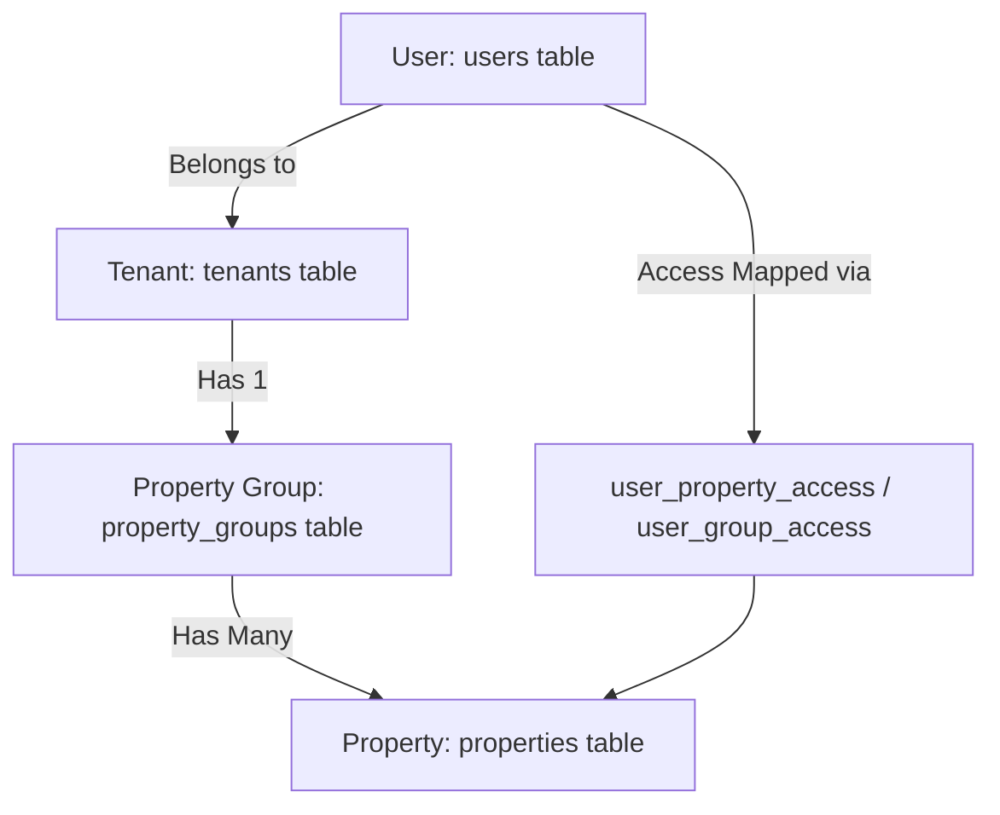

# Property Provisioning and Multi-Tenant Isolation Walkthrough

This document walks through the lifecycle of creating a new property and explains how property-level and tenant-level isolation are enforced to prevent data leaks.

---

## 🏗️ 1. Architecture Overview

The V2 Ecosystem architecture is hierarchical:
1. **Tenant** (`tenants` table): The top-level customer subscription boundary (e.g., a resort chain or hotel brand). Evaluated by `tenant_id`.
2. **Property Group** (`property_groups` table): A structural collection of properties. A tenant points to a single `property_group_id`.
3. **Property** (`properties` table): A physical location or business unit (e.g., a specific resort, hotel, or chalet complex). A property group can contain multiple properties.
4. **User** (`users` table): Authenticated staff, managers, or customers. Users are mapped to tenants and assigned to specific properties.



---

## 🛠️ 2. How a Property is Created

### A. Automatic Provisioning (Default Property)
When a new customer signs up (triggered by a Stripe checkout event), the [ProvisioningService](file:///c:/Alessandro/Work/Attempts%20to%20Code/V2%20Ecosystem/v2-resort/backend/src/modules/platform/provisioning.service.ts) automatically creates the tenant, group, default property, and owner user:

1. **Create Property Group**: Creates a row in `property_groups` representing the default group for the tenant.
2. **Create Tenant**: Creates the top-level `tenants` record, linking it to the new `property_group_id`.
3. **Create Default Property**: Inserts the default property record in the `properties` table, linked to the `property_group_id`.
4. **Slug Generation**: Generates a DNS-compliant `public_slug` for customer-facing routing. To avoid collisions, it uses `generateUniquePublicSlug()`, which checks the group for duplicate slugs and appends numeric suffixes (e.g., `operator-property-1`, `operator-property-2`).

### B. Administrative Property Creation (Additional Properties)
For Growth and Enterprise tenants, admins can add new properties through the multi-property management module:
1. The admin initiates property creation via the admin panel.
2. The backend validates feature limits (e.g., checking if the tenant has reached the maximum allowed properties for their subscription plan).
3. A new row is inserted into the `properties` table under the tenant's `property_group_id`.
4. The admin assigns users (staff/managers) to the new property by creating rows in the `user_property_access` junction table.

---

## 🛡️ 3. Multi-Property Isolation (Within the Same Tenant)

When multiple properties exist within a single tenant (e.g., *Resort A* and *Resort B* both belonging to *Acme Corp*), they must be strictly isolated:

### A. Database-Level Isolation
* **Direct Columns**: Every operational or transactional database table (e.g., `bookings`, `transactions`, `housekeeping_tasks`, `inventory_items`) contains a `property_id` column.
* **Row-Level Security (RLS)**: PostgreSQL enforces access control at the engine level. Every query automatically filters by the user's active property using the RLS policy:
  ```sql
  CREATE POLICY transactions_isolation ON public.transactions
    AS RESTRICTIVE USING (user_has_property_access(property_id));
  ```

### B. Access Control Mapping
User access is governed by mappings in the database:
1. **Direct Assignment**: Mapped via the `user_property_access` table (user -> specific property).
2. **Group Assignment**: Mapped via the `user_group_access` table (user -> group of properties).
3. **Bypass Rules**: Platform operators/super-admins bypass property access validation to perform global administration tasks.

### C. Request Context Resolution
Every incoming API request is resolved to a specific property context:
1. **Public/Customer Traffic**: The property context is determined from the request itself. The frontend middleware parses the subdomain/sub-subdomain and passes it as `X-Property-Slug`. The [propertyResolution.middleware.ts](file:///c:/Alessandro/Work/Attempts%20to%20Code/V2%20Ecosystem/v2-resort/backend/src/middleware/propertyResolution.middleware.ts) looks up the property by slug within the tenant's group.
2. **Authenticated Staff/Admin Traffic**: Admin users select their active property in the console. The frontend sends the property's UUID in the `X-Property-ID` header. The [propertyAccess.middleware.ts](file:///c:/Alessandro/Work/Attempts%20to%20Code/V2%20Ecosystem/v2-resort/backend/src/middleware/propertyAccess.middleware.ts) validates that the user is authorized to access that specific property before attaching the context to the request.

---

## 🔒 4. Cross-Tenant Property Isolation (Same Name, Different Tenants)

A common multi-tenant challenge is avoiding conflicts when different tenants create properties with the same name (e.g., both Tenant A and Tenant B having a property named `"Default Property"`).

The system handles this through a strict **Dual-Layer Isolation Gate**:

### A. Tenant-First Evaluation
The database RLS policies evaluate `tenant_id` first. Since `tenant_id` is derived securely from the authenticated user's JWT metadata (`auth.jwt() -> 'user_metadata' -> 'tenant_id'`), a user from *Tenant A* can only query rows associated with *Tenant A*. 
PostgreSQL automatically discards all rows belonging to *Tenant B* before applying property-level checks.

### B. Group-Scoped Namespaces
* Properties do not belong directly to a global namespace. They belong to a specific `property_group_id`.
* The `property_group_id` belongs to a single tenant.
* A unique index constraint prevents `public_slug` collisions **within the same property group**, but permits identical slugs across different groups (meaning different tenants).
* When resolving `X-Property-Slug`, the lookup query is strictly scoped to the tenant's group:
  ```sql
  SELECT * FROM properties 
  WHERE group_id = :tenant_group_id AND public_slug = :slug;
  ```
  Consequently, even if both tenants have a property named `"default"`, Tenant A's resolution query only searches Tenant A's group, and Tenant B's resolution query only searches Tenant B's group.

---

## 📂 5. Key Files & Reference Implementations

* **Provisioning Flow**: [provisioning.service.ts](file:///c:/Alessandro/Work/Attempts%20to%20Code/V2%20Ecosystem/v2-resort/backend/src/modules/platform/provisioning.service.ts)
* **Tenant Gating**: [tenantAccess.middleware.ts](file:///c:/Alessandro/Work/Attempts%20to%20Code/V2%20Ecosystem/v2-resort/backend/src/middleware/tenantAccess.middleware.ts)
* **Property Resolution (Public)**: [propertyResolution.middleware.ts](file:///c:/Alessandro/Work/Attempts%20to%20Code/V2%20Ecosystem/v2-resort/backend/src/middleware/propertyResolution.middleware.ts)
* **Property Access Validation (Auth)**: [propertyAccess.middleware.ts](file:///c:/Alessandro/Work/Attempts%20to%20Code/V2%20Ecosystem/v2-resort/backend/src/middleware/propertyAccess.middleware.ts)
* **DB Isolation Migration**: [20260624010000_audit_isolation_remediation.sql](file:///c:/Alessandro/Work/Attempts%20to%20Code/V2%20Ecosystem/v2-resort/supabase/migrations/20260624010000_audit_isolation_remediation.sql)
